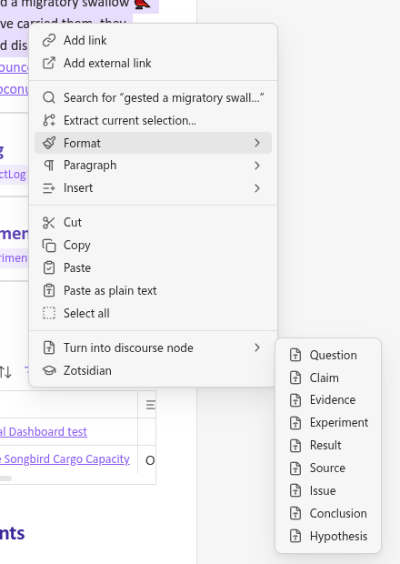
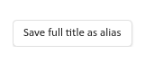
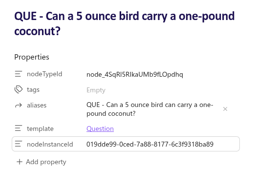
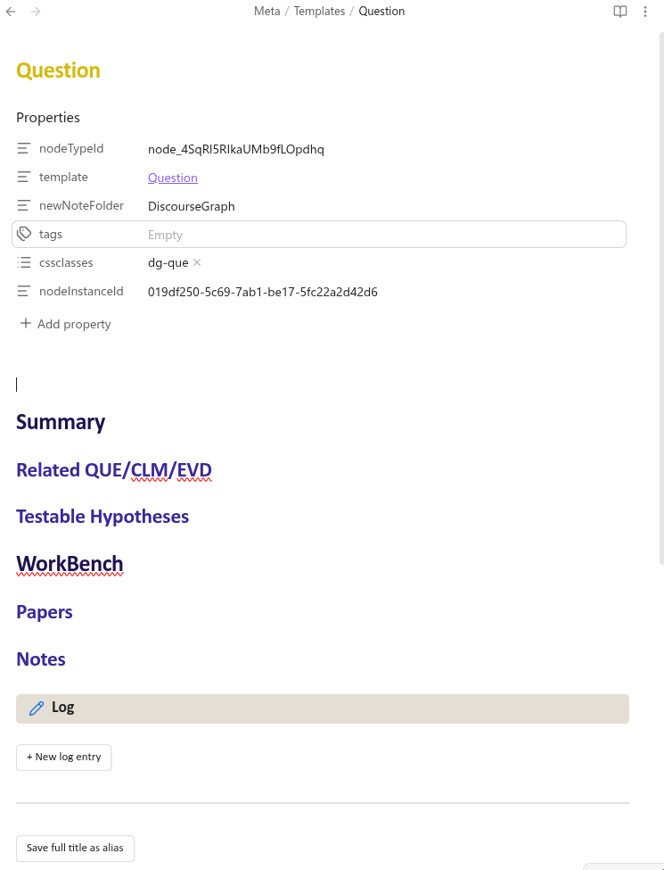
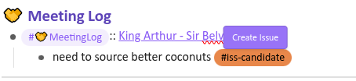
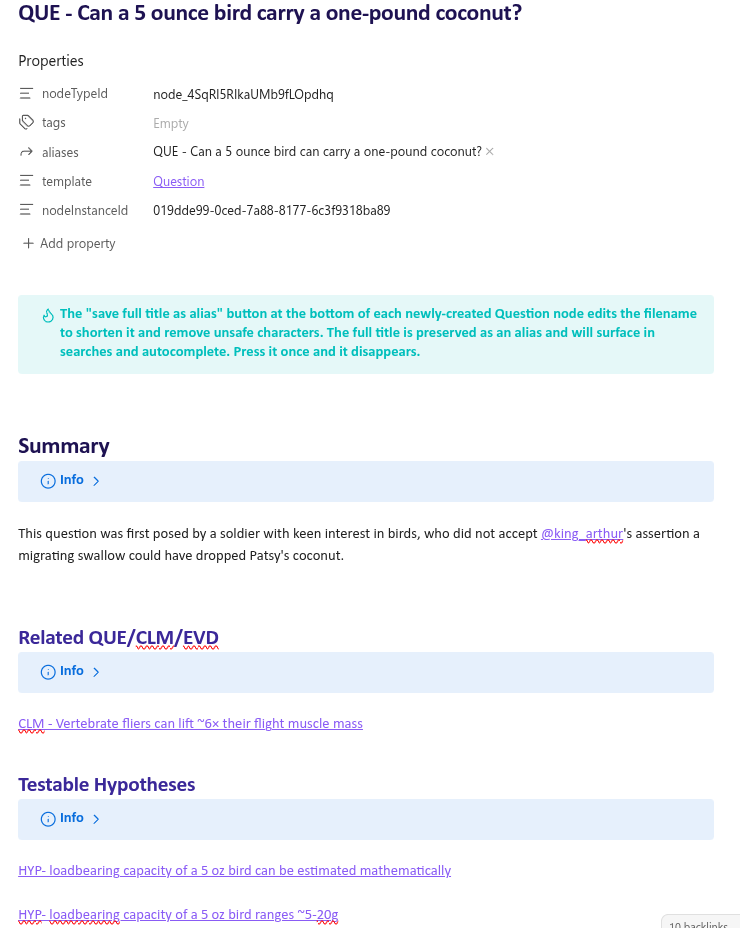

A discourse graph orients your intellectual work around a central motivating question. So the first step in creating a graph is to identify or formulate an interesting question. 

## Creating a node from selected text

If the question has already been recorded in your notes, you can simply highlight the relevant text with your mouse, right-click
and select _"Turn into discourse node"_ 

![[create QUE.gif|400]]

**or** highlight the selected text, Press `Ctrl + \` (or your configured hotkey) and open the node menu as a popup

![[create QUE02.gif]]

This will create a new note using the "Question" template having the title of the text you selected.

## Creating a node from scratch

You can also create a node _de novo_ from anywhere in your graph using the "Create discourse node" hotkey (`Ctrl +\` in this vault)

![[create QUE03.gif]]

**or** by creating a new page in your graph, giving it a title appropriate for its node type, and selecting the correct template from the **Templater** menu in the left sidebar. 

![[create ISS.gif]]

## Aliasing node titles

Discourse graph node titles are also filenames.

You might decide that you want to edit the node title  for clarity after creation. Once you're satisfied with the title, click the button "save full title as alias" - this will truncate the title and remove characters that don't play well with filenames. The full title will be saved in the "alias" property field, and will be used in search and autocomplete. The button will self-destruct after use, after which the title and "alias" field can be edited manually.

## Node templates & properties

Each node type (QUE, CLM, EVD, etc) has its own particular set of properties stored as frontmatter. All nodes have a nodeTypeId which they share with all other nodes of the same type, and an alias field. Tags can be used to improve searchability.  Other fields can differ by node type, and you can add additional properties to fit your use cases.

Node templates can be found in the **"Meta/Templates"** folder in this example vault, and edited like any Obsidian note. 

## Candidate nodes

You may sometimes feel hesitant to immediately label an observation as a **Result.** If you're not ready for that level of commitment, you can use **candidate nodes** to tag ideas & observations for later review. 
    - `#iss-candidate` can be used to tag potential problems or ideas for experiments. Maturing it into an **Issue** brings it to the attention of everyone working on the Project. This can be used to create a "Request for Experiments" within your lab group.
    - `#res-candidate` can be used to tag observations that could be used to support/oppose a hypothesis. You can formalize your interpretation of the relevant data artefacts by creating a **Result**
    - `#evd-candidate` can be used interchangeably with result candidate. Some users prefer this term to tag observations originating from the literature vs. their own experimental work. You can develop your own criteria (# of sources? published data?) to formalize it as **Evidence**
    - `#hyp-candidate` can be used when you formulate an alternative hypothesis to describe your expectation or explain your results. It can also be used to denote untested claims. A formalized **Hypothesis** forms the target for a project.
    - `#clm-candidate` is roughly equivalent to hypothesis candidate. It can be used to differentiate your own hypotheses with claims from the literature,  where that distinction is relevant. A mature **Claim** is an assertion relevant to your research question that you intend to address in your work.
    - `#que-candidate` is roughly equivalent to the hypothesis candidate. A mature **Question** can be the origin point for a project or the branching-off point for a new project.

### Creating candidate nodes

You can create a candidate node either by typing out the appropriate node tag (e.g. `#iss-candidate') or by using the `\` hotkey to summon the candidate node menu. The line containing your cursor will be tagged with the candidate node you choose.

![[create-node-cand.gif]]

You can view your existing candidate nodes in the [[Candidate Nodes|Candidate Nodes]] Dashboard. You may wish to regularly review this dashboard and select nodes to promote to mature discourse nodes, after which they can be found in the [[Discourse Graph Nodes.base]]. 

To promote a candidate node, hover over with it with your cursor. A "Create {Node}" button will appear which will launch the node creation dialogue.

## Getting started building your graph

The initial question in the [[Canvas - PRJ - Passarine Songbird Cargo Capacity|tutorial graph]] is [[QUE - Can a 5 ounce bird carry a one-pound coconut?]]

Your first Question node is the seed for the rest of your graph. You can begin sketching out your Hypotheses addressing the Question or adducing a few Claims from the literature. Once you have a few nodes, you're ready to begin [[Creating Relations]].

[[Creating Nodes]] and [[Creating Relations]] are the basic discourse moves. Once you're familiar with both discourse moves you can embed them in a sensemaking activity:

- [[Build and Utilize a Personal Knowledge Base]]
- [[Synthesize Insights from the Literature]]
- [[Track your Projects and Experiments]]