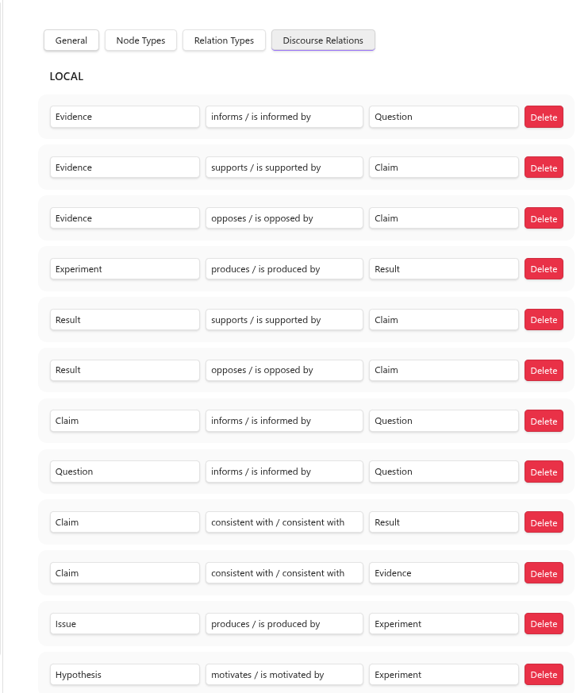
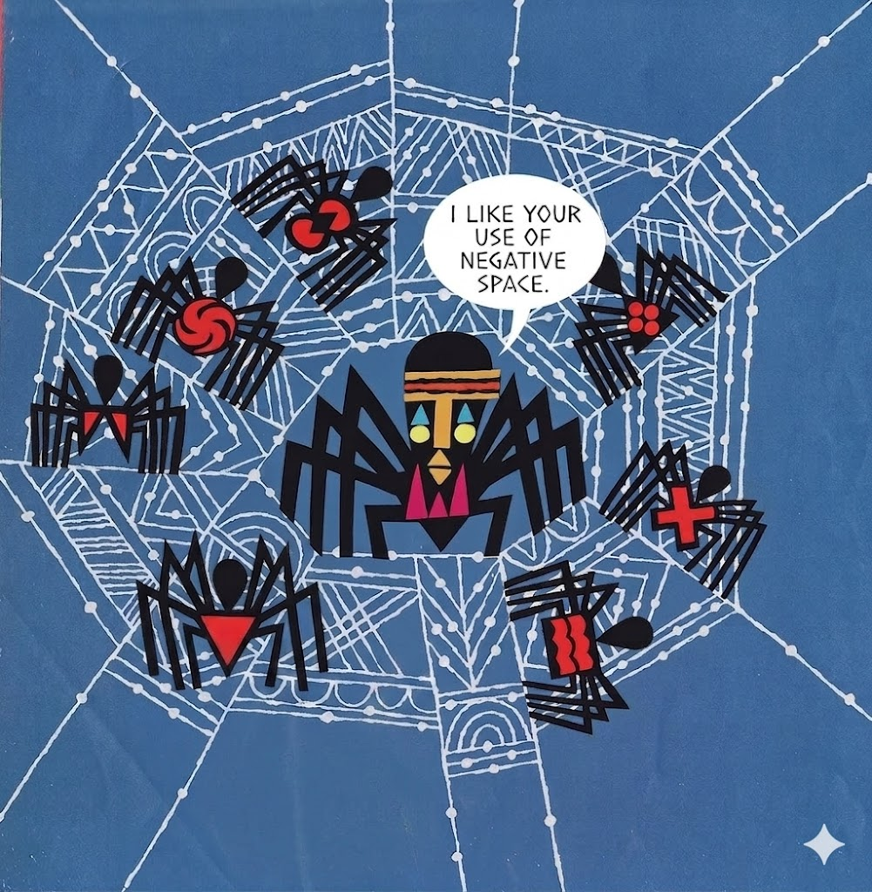

## What are Relations?

Relations are first-class objects on equal footing with nodes in the discourse graph schema. They are graph edges that  carry necessary information about the relationship of different nodes to each other.

You can view the relations that ship with this example vault in the discourse graph plugin _Settings_ menu, under _Relation types_.

This is not an exhaustive list of the types of relations that are possible, but it is a nice starter pack for exploring the base schema. 

You can see how we use relations to "wire together" different types of discourse nodes on the _Discourse Relations_ tab.

Relations are a way of describing which contributions _inform_, _support_ or _conflict_ with each other, as well as more ambiguous relationships like every researcher's favorite hedge, "consistent with."

Relations carry semantic information, but they also help to orient your graph in conceptual space. You can see this in action when you move nodes around on the Canvas, informed/constrained by the epistemic topology created by the relations.

![[drag-rel.gif]]

## Creating relations

To create a relation, open the source node that you'd like to create a relation from and then open the _Discourse Context_ by clicking the telescope icon on the left sidebar.
(The Discourse Context can also be accessed via hotkey or the Command Palette, `Ctrl-P` in this vault)
1. Select "Add a new relation"
2. Choose the relationship type from the dropdown. The options here are those you created in the _Discourse Relations_ tab from the relation types you defined in the _Relation Types_ tab.
3. Search for the target node by its title.
4. Select "Confirm" to create the relationship.

![[create-rel02.gif]]

## Building out your graph

Creating relations between your nodes is a good way to discover what's missing from your project/knowledge base/argument. 

[[Creating Nodes]] and [[Creating Relations]] are the basic discourse moves. Now you're ready to embed them in a sensemaking activity:
- [[Build and Utilize a Personal Knowledge Base]]
- [[Synthesize Insights from the Literature]]
- [[Track your Projects and Experiments]]