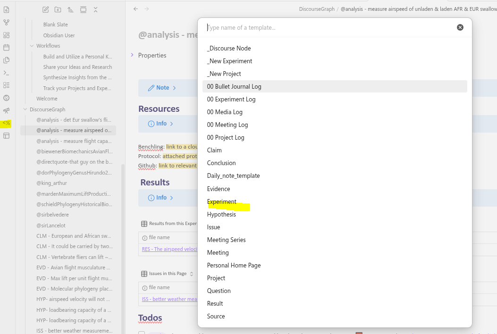
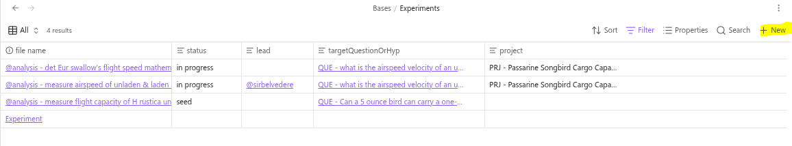
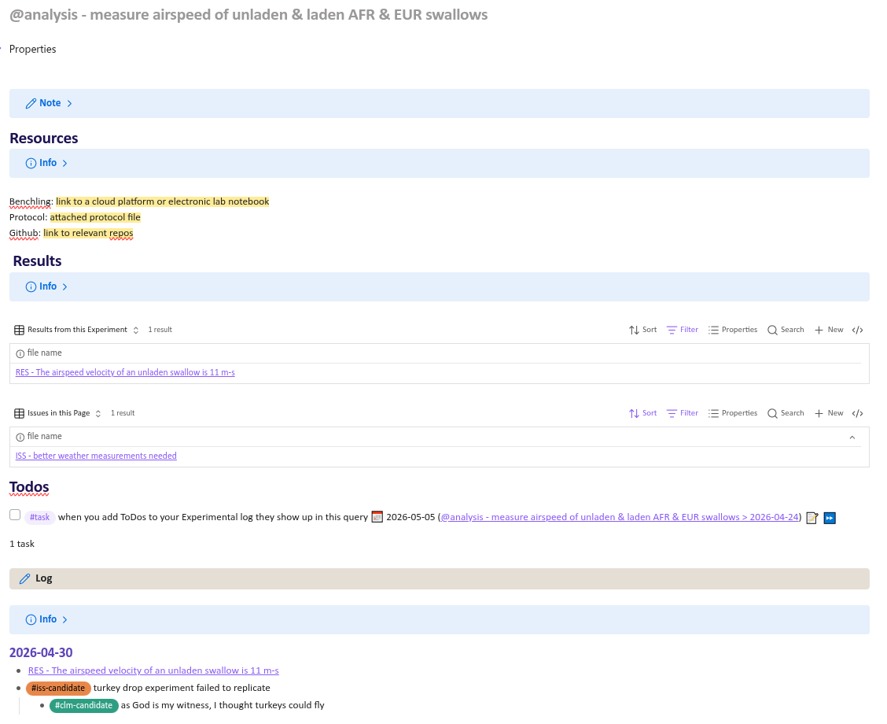
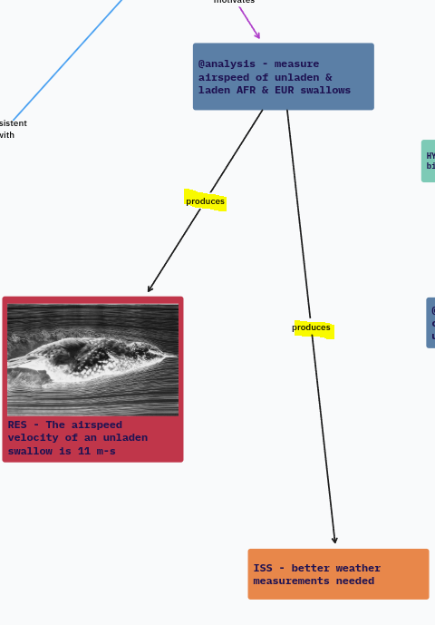

## How to use Experiments

The **Experiment** is a container for your day-to-day work exploring a **Hypothesis.** It consists of  an __intervention__ and a __metric__ used to track the result of that intervention. The **Result** is a statement of your observations regarding that intervention in terms of the appropriate metric. 

Making an experiment page helps you track multiple days' work and reflect on your progress towards your experiment target.
Ideally the target is a **Hypothesis** you are testing, and the experiment page is a space to document and reflect on **candidate results** for that hypothesis.

### A quick word on candidate nodes
**Candidate Results** are  preliminary observations attached to a particular experiment. They might be first impressions formed from a certain data artefact. Use this tag to mark candidate results:  #res-candidate
 **Candidate Issues** surface potential problems or future experiments. Use this tag to mark candidate issues:  #iss-candidate

When you're more confident in the observation, you can use the "Create Discourse Node" popup to convert the candidate result into a proper Result. This will affect where the Result appears in queries and its appearance on your Project Canvas. It will also give you a warm sense of accomplishment (this can be done to mature all [[Candidate Nodes | candidate node types]]).

## Creating experiments

You can create a new experiment by

1. Creating a new note and applying the Experiment Template from the Templater menu in the left sidebar

2. Navigating to your "Experiments" base in the "Bases" folder and selecting "+ New" 

3. Using any of the methods to [[Creating Nodes| create a discourse node]] (Remember, an Experiment is a  type of **Source**)

### Example experiments 

This vault contains several example experiments demonstrating how the Experiment page can be used. 

This page collects **Issues**, **Results**, and **ToDos** related to the experiment, as well as references to the experiment from your **Experimental Log** on your Daily Notes Page. The experiment page is the natural place to review candidate results snd issues and decide whether they should be promoted to mature Results and Issues/Experiments.

## Experiment relations

As a **Source** node, the **Experiment** has a special relationship to **Result** nodes: the **Experiment** _produces_ **Results**. 

Conversely, each Result in your graph should reference an Experiment.

The Experiment also has a relationship with the **Issue** node, as Experiments _suggest/produce_ **Issues** that may later be developed into Experiments.

