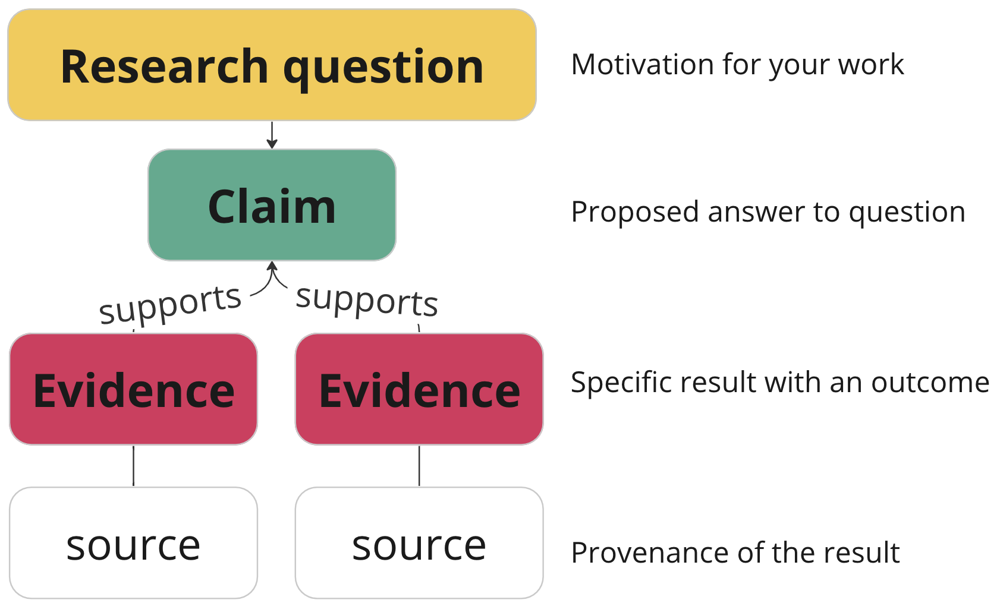
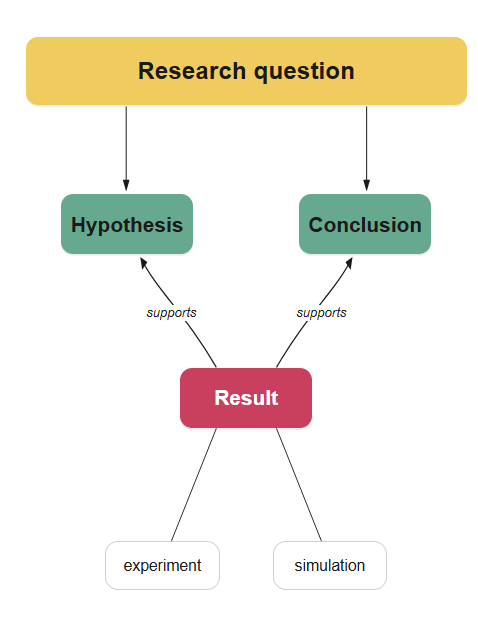

## Why discourse graphs?

### For improving your own work

It's easier to build upon and share your research if you work with its atomic parts: **questions**, **claims**, and **evidence** supported by **sources**. 

### For understanding the literature

Metabolizing the academic literature into its components allows you as a reader to understand where a published work  intersects with your own research interests, where an argument is weak or underdeveloped, and where your own contributions can have the greatest impact.

## What is a discourse graph?

A discourse graph has 4 types of nodes : 1) Questions, 2) Claims, 3) Evidence, and 4) Sources. 

- The **Question** is the scientific unknown that we want to make known.

- A **Claim** is an atomic, generalized assertion about the world that purports to answer a research question. 

- **Evidence** is a specific observation from a particular research method.

- A **Source** reports/generates evidence. Examples include experiments, books, and journal article.

Some researchers prefer to make a distinction between graph nodes sources from their own work and those derived from the literature. Instead of a **Claim** they might have a **Hypothesis** (untested claim) or a **Conclusion** (tested claim), and empirical observations they make directly are termed **Results** instead of evidence. The **Source** in these cases is usually an experiment or simulation rather than a published or presented work.

These nodes can replace or coexist with the base grammar described above. The only requirement is that you are consistent within your discourse graph "headcanon" and its mapping to the base grammar.

But nodes alone don't make a graph: we also need **relations**.