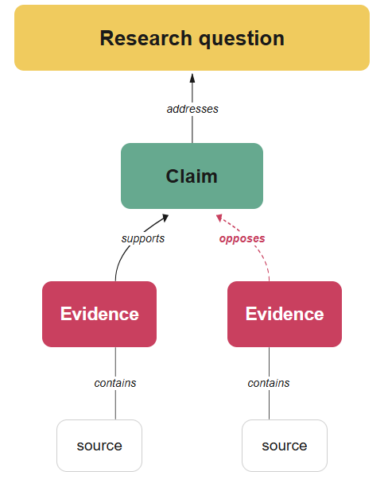
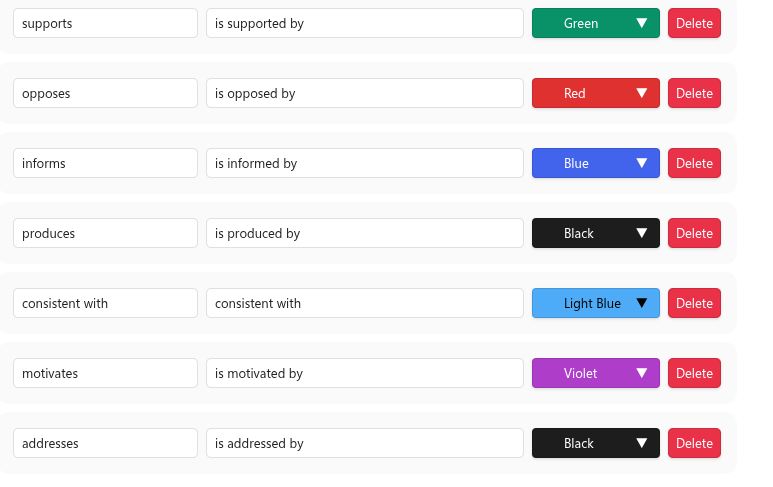
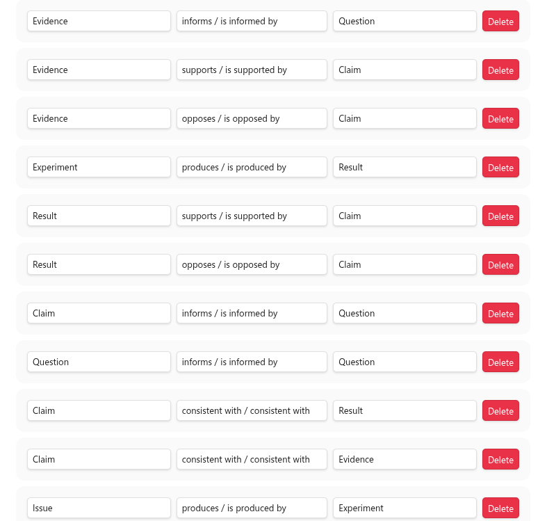
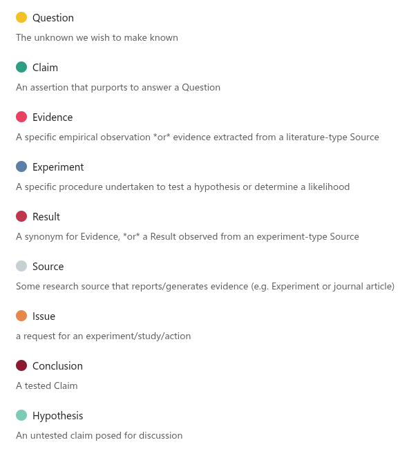

## Why discourse graphs?

### For improving your own work

It's easier to build upon and share your research if you work with its atomic parts: **questions**, **claims**, and **evidence** supported by **sources**. 

### For understanding the literature

Metabolizing the academic literature into its components allows you as a reader to understand where a published work  intersects with your own research interests, where an argument is weak or underdeveloped, and where your own contributions can have the greatest impact.

## What is a discourse graph?

A discourse graph has 4 types of nodes : 1) Questions, 2) Claims, 3) Evidence, and 4) Sources. 

- The **Question** is the scientific unknown that we want to make known.

- A **Claim** is an atomic, generalized assertion about the world that purports to answer a research question. 

- **Evidence** is a specific observation from a particular research method.

- A **Source** reports/generates evidence. Examples include experiments, books, and journal article.

**💡 A note about Claims and Evidence:**
-  A **claim** is a general statement including an interpretation, while the **evidence** is the specific observation or measurement carried out by a particular study. 
	- For example: 
		- CLM: Split keyboards are gentler on wrists than straight keyboards. 
			- Supported by 
		- EVD: A laboratory study of 20 participants using an adjustable keyboard showed that wrist angle strongly correlated with carpal tunnel pressure (Rempel et al. 2008, Table 1).

Some researchers prefer to make a distinction between graph nodes sources from their own work and those derived from the literature. Instead of a **Claim** they might have a **Hypothesis** (untested claim) or a **Conclusion** (tested claim), and empirical observations they make directly are termed **Results** instead of evidence. The **Source** in these cases is usually an experiment or simulation rather than a published or presented work.

These nodes can replace or coexist with the base grammar described above. The only requirement is that you are consistent within your discourse graph "headcanon" and its mapping to the base grammar.

But nodes alone don't make a graph: we also need **relations**.

In this schema, 
- **Sources** report/contain/generate **Evidence**/**Results**
- **Evidence** can either **support** or **oppose** a **Claim**
- **Claims** address a **Question**

You can also describe these relations in the passive voice (e.g. "This Claim is supported by this Result, this Result was generated by this Experiment).

This example vault ships with a selection of predefined nodes and relations developed for scientific research. But you can modify and define new nodes and relations in the plugin settings menu to better fit your needs.

> [!info]-
> Learn how to [[Creating Nodes|create new discourse nodes]] and [[Creating Relations|relations]]

For example, this graph includes **Experiment** as a particular type of source that you may wish to use your graoh to design and track -- a different interaction pattern from the extraction and interpretation activities you might perform with a literature source. It also contains an **Issue** node, which is a proto-Experiment that might be motivated by observations you make during your current experimental work, or by your working hypothesis.

## Some practical examples

This example graph includes a [[PRJ - Passarine Songbird Cargo Capacity|tutorial project]] that demonstrates how these nodes behave in the wild.

- The **Question** [[QUE - Can a 5 ounce bird carry a one-pound coconut?|QUE - Can a 5 ounce bird can carry a one-pound coconut?]]   ➡  motivates the **Hypothesis** [[HYP- loadbearing capacity of a 5 oz bird ranges ~5-20g]], which in turn motivates the **Experiment** ➡ [[@analysis - measure flight capacity of H rustica under load]], which produces the **Result** ➡  [[RES - 5g max load at sustained cruising]]. This result does not support the claim that [[CLM - It could be carried by two swallows with a bit of string]].

A perusal of the [[Canvas - PRJ - Passarine Songbird Cargo Capacity|discourse canvas describing the project]] shows how discourse graphs can be used to track the claims and evidence in _ongoing, unpublished_ research: there's a second question on the Canvas, [[QUE - what is the airspeed velocity of an unladen swallow?|QUE - what is the airspeed velocity of an unladen swallow?]] that popped up during on of the experiments related to [[QUE - Can a 5 ounce bird carry a one-pound coconut?|QUE - Can a 5 ounce bird can carry a one-pound coconut?]] and is now motivating a related research thread. The two questions partially converge at one experiment, [[@analysis - measure airspeed of unladen & laden AFR & EUR swallows]], which may have important ramifications for the future of bridge-troll initiated fluid mechanics research.

The question motivating a discourse graph is usually large enough that it take multiple experiments to address -- but it may spawn other sub-questions of its own (as you can see from [[QUE - African or European?]] ) of different scope. The tutorial project is an attempt to replicate the serendipitous nature of many research initiatives, with their various tributaries and sidequests.

Now that' we've gone over the conceptual underpinnings, let's [[Creating Nodes|get started building your graph]]

> [!info] Learn more about the discourse graph conceptual schema [here](https://github.com/DiscourseGraphs/schemas/blob/main/README.md) 

> [!tip] Check out a discourse graph dialect developed for the field of huma/computer interaction [here](https://github.com/DiscourseGraphs/schemas/blob/main/conceptual-schema-draft.md#discourse-graphs-and-hci)