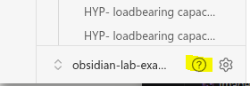
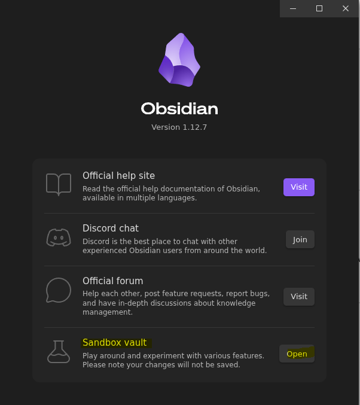

> [!tip] If you're new to Obsidian, familiarize yourself with the app by exploring the Obsidian Sandbox vault. You can open the vault by clicking the "?" next to the gear icon on the lower left-hand panel of the app. Then come back here to learn about Discourse Graphs.

Finished the Sandbox Vault? Great! 

Learn the building blocks of the  [[The Discourse Graph Protocol| Discourse Graph protocol]]

