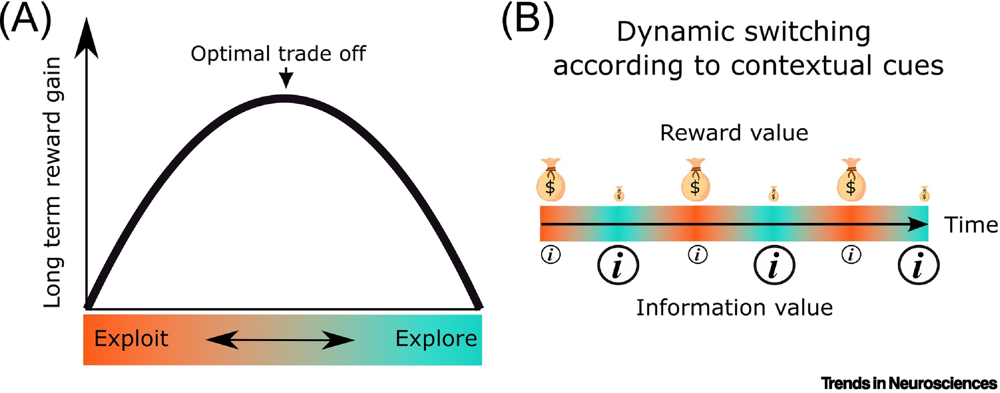

🚧 Under Construction 👷‍♂️

## Literature Synthesis with discourse graphs

Discourse graphs turn literature synthesis into a **question-directed activity**: instead of merely absorbing disconnected insights from different sources, the discourse graph workflow orients your reading around a central guiding question of your own devising. 
- #hyp-candidate This purpose-driven reading increases engagement with the text and retention of salient data. 
- #hyp-candidate It also incentivizes reading widely and strategically, as papers from many different authors/fields may have made small but significant contributions to your question.

There's a bit of a chicken-and-egg problem here, as engaging in question-driven analysis of the literature first requires the development of a question, which usually involves at least some loosely-directed exploration.  Discourse graphs accommodate both phases of the explore/exploit curve.

## Building your library of sources

Let's assume that your exploration phase is influenced by the items in your reference manager/personal library. Obsidian offers a variety of plugins for interacting with reference management software.

This example vault uses [Zotsidian](https://github.com/Qiwei-Zhao/zotsidian), a Zotero integration plugin with built-in discourse graph support. 🥰

> [!info]- If you like your reference manager, you can keep your reference manager --  they all play well with discourse graphs
>  

### Managing literature sources with Zotsidian

- Make sure you have Zotero Desktop  ≥ 8 installed and running
    - In Zotero, go to `Settings / Preferences -> Advanced` and make sure `Allow other applications on this computer to communicate with Zotero` is enabled.
- Make sure you have citekeys for the Zotero items you want to work with
    - Install the Better BibTeX (BBT) plugin from https://retorque.re/zotero-better-bibtex/ to automatically generate citekeys 
- [Install Zotsidian](https://github.com/Qiwei-Zhao/zotsidian#install-from-github-release) and enable the plugin 
- check your plugin settings:

-how to format citations (use `[[double brackets]]` if you want sources to be wikilinked immediately )
- where to store newly-created source nodes
- which template to use
- whether to show a hover-over infobox when a citation is imported

#clm-candidate The hovercard is useful when you're creating a lot of Source pages at once but can interfere with other mouse-over operations. 

In this vault the hotkey `Ctrl-Shift-Y` opens a search panel that you can use to search for references in your Zotero library.

You can also search inline by  typing "@..." which will autocomplete with your zotero references after 2 letters.

## Synthesis workflows

### EVD and CLM mining

## What else would you like to do?

- [[Build and Utilize a Personal Knowledge Base]]
- [[Track your Projects and Experiments]]
- [[Share your Ideas and Research]]