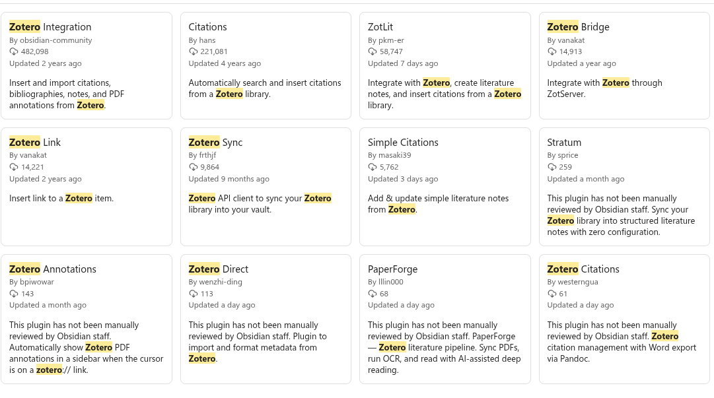
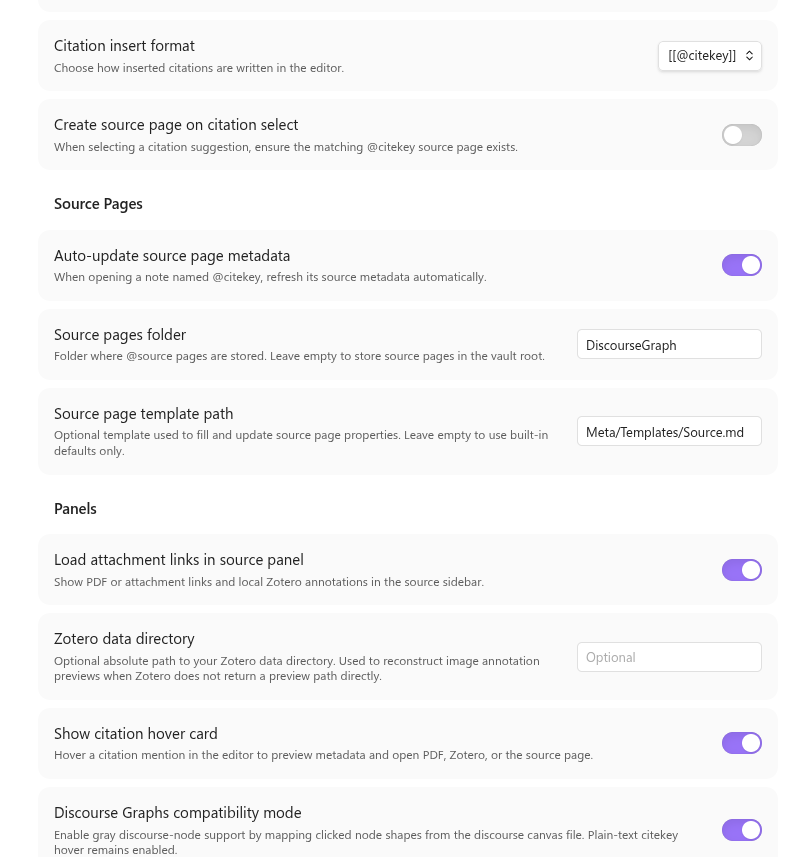
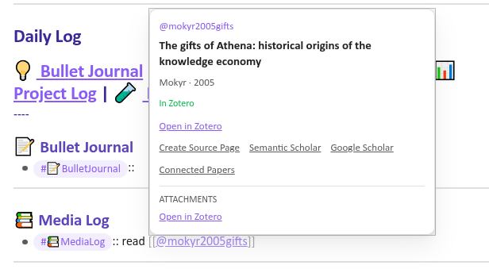
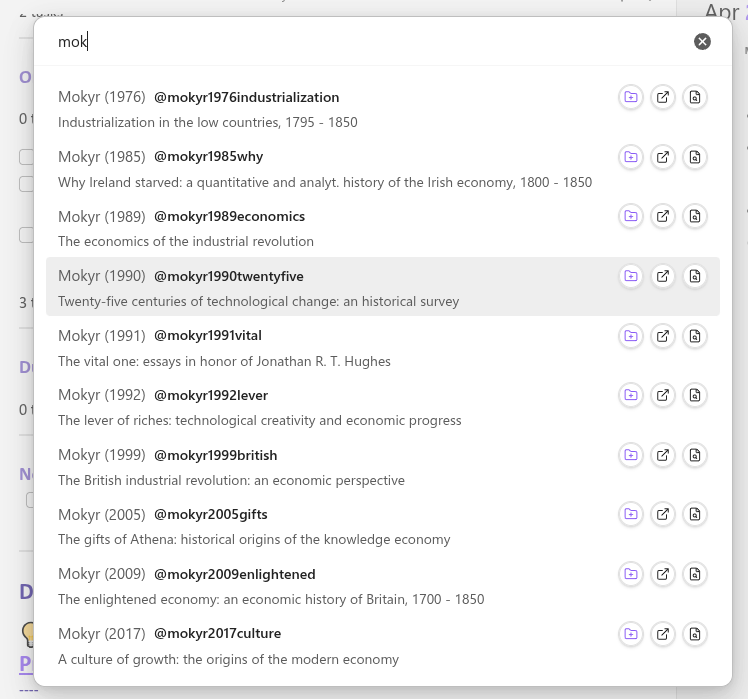
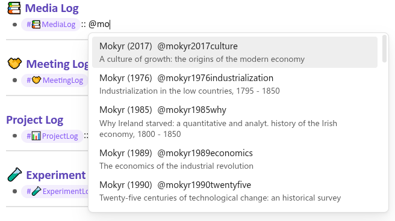
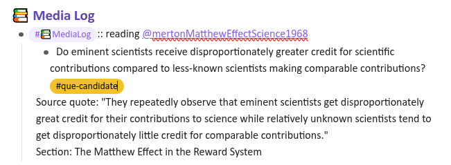
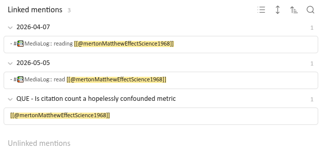
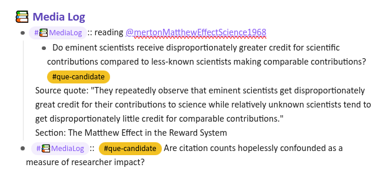
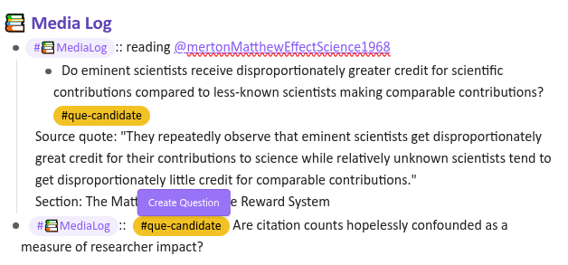

## Literature Synthesis with discourse graphs

Discourse graphs turn literature synthesis into a **question-directed activity**: instead of merely absorbing disconnected insights from different sources, the discourse graph workflow orients your reading around a central guiding question of your own devising. 
- #hyp-candidate This purpose-driven reading increases engagement with the text and retention of salient data. 
- #hyp-candidate It also incentivizes reading widely and strategically, as papers from many different authors/fields may have made small but significant contributions to your question.

There's a bit of a chicken-and-egg problem here, as engaging in question-driven analysis of the literature first requires the development of a question, which usually involves at least some loosely-directed exploration.  Discourse graphs accommodate both phases of the explore/exploit curve.

## Building your library of sources

Let's assume that your exploration phase is influenced by the items in your reference manager/personal library. Obsidian offers a variety of plugins for interacting with reference management software.

This example vault uses [Zotsidian](https://github.com/Qiwei-Zhao/zotsidian), a Zotero integration plugin with built-in discourse graph support. 🥰

> [!info]- If you like your reference manager, you can keep your reference manager --  they all play well with discourse graphs
>  

### Managing literature sources with Zotsidian

- Make sure you have Zotero Desktop ≥ 8 installed and running
    - In Zotero, go to `Settings / Preferences -> Advanced` and make sure `Allow other applications on this computer to communicate with Zotero` is enabled.
- Make sure you have citekeys for the Zotero items you want to work with
    - Install the Better BibTeX (BBT) plugin from https://retorque.re/zotero-better-bibtex/ to automatically generate citekeys 
- [Install Zotsidian](https://github.com/Qiwei-Zhao/zotsidian#install-from-github-release) and enable the plugin 
- check your plugin settings:

These settings control:
	
-   how to format citations (use `[[double brackets]]` if you want sources to be wiki- linked immediately )
-   where to store newly-created source nodes
-   which template to use
-   whether to show a hover-over infobox when a citation is imported

>[!tip] #clm-candidate The hovercard is useful when you're creating a lot of Source pages at once but can interfere with other mouse-over operations. 

In this vault the hotkey `Ctrl-Shift-Y` opens a search panel that you can use to search for references in your Zotero library.

You can also search inline by  typing "@..." which will autocomplete with your zotero references after 2 letters.

## Using Obsidian Bases to organize your reading

You can also navigate and manage your Sources via Obsidian's built-in **Base** feature. This vault contains an example [[Sources.base | Source base]] where you can organize your Sources by citekey, tags, reading status, target Question, or any other frontmatter property.

## Synthesis workflows

At the outset of the _exploration_ phase, you probably have a topic in mind, or an assertion vaguely in the shape of a question/hypothesis that needs further refinement. You may be reading the literature to understand prior art on the topic. At this point, before a Question or Project has coalesced,  some users like to take notes on their **Daily Notes Page**, in the **Media Log**:

> [!info]- As long as you use wikilink syntax (`[[mertonMatthewEffectScience1968]]`) the notes you make here  will be referenced at the bottom of the appropriate Source page so that you can find them later. 
> 

The Media Log provides a low-overhead way of taking quick notes that can later be converted to structured note-taking.

Reflecting on your reading might inspire you to develop a few candidate questions of your own: 

After further reading, you're ready to formalize one of these candidates as the Question driving your literature review:

Now you can read and revisit articles in light of your guiding question, and search for **Claims** _addressing_ the **Question** and **Evidence** _supporting_ those **Claims**.

### EVD and CLM mining

As you read the literature, capture claims and evidence relevant to your Question. You can track them on the Question page itself, on the relevant Source page, or anywhere else in your graph -- as long as you tag relevant items with [[QUE - {your question}]], these mentions will be linked at the bottom of your Question page.

## Integrating findings from the literature with your research

The [[Using the Canvas|Discourse Canvas]] can be used to assemble your claims and evidence into an overview of the state of the field in relation to your target question.

As you collect and assimilate claims and evidence sourced directly from the literature, you will probably develop a few claims of your own that derive from your reading but aren't directly statewd in any of the articles. This is your **Synthesis Claim**: an initial position on the question that you'd like to test further. 

This synthesis claim can be used as a springboard for more directed reading and the development of an experiment, simulation, or other test.

Once you've metabolized the claim to find testable components, you can add those components to your graph as **Hypotheses** and begin developing **Experiments**. 

The multiple layers of the tldraw discourse canvas facilitate organizing your research campaign into _literature review_ and _project planning phases_.

In the discourse graph workflow, these phases are largely simultaneous and mutually informative.

>[!tip] We're developing an LLM-assisted workflow for extracting claims & evidence from the literature. Join us on [Slack](https://join.slack.com/t/discoursegraphs/shared_invite/zt-37xklatti-cpEjgPQC0YyKYQWPNgAkEg) to learn more.

## What else would you like to do?

- [[Build and Utilize a Personal Knowledge Base]]
- [[Track your Projects and Experiments]]
- [[Share your Ideas and Research]]