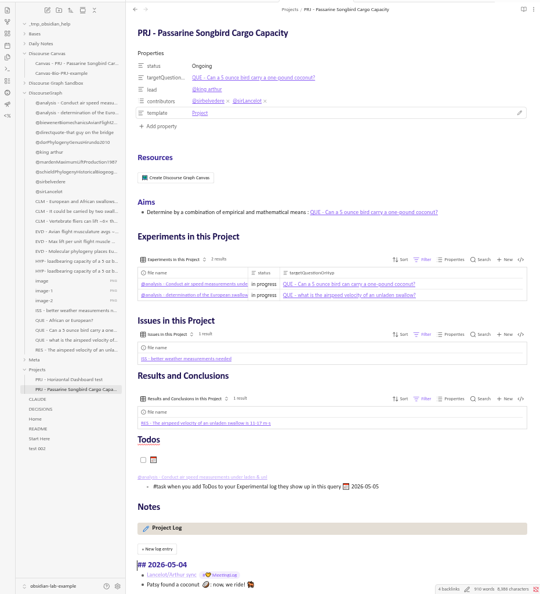

## How to use Projects 

The **Project** acts as a container for multiple activities exploring a particular research question. You can think of it as a conceptual framework to structure a set of Discourse nodes related to a certain research goal.

Use Project pages to
- Prioritize experiments
- Stay oriented toward and reflect on your progress toward your project target/question
- Keep relevant resources at hand (links, etc)

 The Project structure facilitates the creation of a traditional research narrative and aids in keeping track of  all the moving parts that go into a scientific ms.

### Examples

This vault contains an example project page, [[PRJ - Passarine Songbird Cargo Capacity]], that demonstrates  a project structure appropriate to experimental research.

- The **Resources** section can be used to organize protocols, references, datasets, reagent lists, etc. It's also a convenient spot to pre-register your working **Hypothesis**

- The **Create Discourse Graph Canvas** button will automatically spin up a discourse canvas named after the project for visual organization of your ideas.

- The **Experiments, Issues, & Results** Bases can be used to keep track of multiple active experiments and filter by status, observations made from those experiments (Results), and ideas for future experiments (Issues). 

- The **ToDo** list collects tasks tagged [[PRJ - Passarine Songbird Cargo Capacity]]

- The **Project Log** can be used to keep track of project updates and link project-relevant information from other parts of your graph. Like your **Daily Notes Page**,  it has a button function for regular entries.

- the **Project Meeting Notes** log will collect references to this project made in meeting notes throughout this graph. 

## How to Create a Project

Create a new project by 

1. Creating a new note in the "Projects" Folder and applying the Project Template from the Templater menu in the left sidebar

2. Navigating to your "Projects" base in the "Bases" folder and selecting "+ New" 

## The relationship between your Projects and your Discourse Graph

In this example vault, the **Project** is not treated as a discourse node but rather an organizational background for other nodes. You can see how this works in the [[Canvas - PRJ - Passarine Songbird Cargo Capacity]]: the Project contains 3 **Questions:**
- the original motivating question: [[QUE - Can a 5 ounce bird carry a one-pound coconut?]]
- a question that arose during the course of the initial investigation:  [[QUE - what is the airspeed velocity of an unladen swallow?]]
- and a sub-question informing that second question: [[QUE - African or European?]]

These three Questions are all part of the same work package, and while their respective edges may eventually meet, we're not going to force it.

## The relationship between your Projects and your Experiments

The Project is also the natural container for the **Experiment** node, which is a flavor of the **Source** node for laboratory work. Your Project will probably contain several experiments -- you can see from the [[Experiments.base]] that each Experiment is associated with a Project via its frontmatter for easier queryability.

Learn more about creating and tracking experiments [[Experiment Tracking | here]]

## What else would you like to do?

- [[Build and Utilize a Personal Knowledge Base]]
- [[Synthesize Insights from the Literature]]
or
- [[Share your Ideas and Research]]