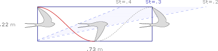

# Resources



# Results

![[Results.base#Results from this Experiment]]
# Todos

```tasks
not done
(path includes {{query.file.path}}) OR (path includes Daily Notes AND description includes {{query.file.filenameWithoutExtension}})
```


> [!log] Log

```datacorejsx
return function AddLogEntry() {
  const current = dc.useCurrentFile();
  const [msg, setMsg] = dc.useState("");

  const handleClick = async () => {
    const file = app.vault.getAbstractFileByPath(current.$path);
    if (!file) return;

    const today = new Date().toISOString().slice(0, 10);
    const content = await app.vault.read(file);

    if (content.includes(`### ${today}`)) {
      setMsg(`${today} already exists`);
      return;
    }

    const sep = "\n---\n";
    const sepIdx = content.indexOf(sep);
    const insertAt = sepIdx !== -1 ? sepIdx : content.length;
    const newEntry = `\n\n### ${today}\n\n- \n`;
    await app.vault.modify(
      file,
      content.slice(0, insertAt) + newEntry + content.slice(insertAt)
    );
    setMsg(`Added ${today}`);
  };

  return (
    <span>
      <button onClick={handleClick}>+ New log entry</button>
      {msg && <span style={{ marginLeft: "0.7em", opacity: 0.55, fontSize: "0.85em" }}>{msg}</span>}
    </span>
  );
}
```

---
> [!log] From daily notes

```datacorejsx
return function View() {
  const current = dc.useCurrentFile();
  const [mentions, setMentions] = React.useState(null);

  React.useEffect(() => {
    if (!current) return;
    const topicTags = (current.$tags ?? [])
      .map(t => String(t).replace(/^#+/, "").trim())
      .filter(t => t && !t.startsWith("dg/"));
    if (!topicTags.length) { setMentions({}); return; }
    let live = true;
    (async () => {
      const vault = dc.app.vault;
      const mcache = dc.app.metadataCache;
      const byTag = {};
      for (const tag of topicTags) byTag[tag] = [];
      for (const file of vault.getMarkdownFiles()) {
        if (file.path === String(current.$path)) continue;
        const cache = mcache.getFileCache(file);
        const hits = (cache?.tags ?? []).filter(
          tc => topicTags.includes(tc.tag.replace(/^#/, "").trim())
        );
        if (!hits.length) continue;
        const text = await vault.cachedRead(file);
        if (!live) return;
        const lines = text.split('\n');
        for (const tc of hits) {
          const tag = tc.tag.replace(/^#/, "").trim();
          byTag[tag].push({
            path: file.path,
            name: file.basename,
            line: (lines[tc.position.start.line] ?? "").trim()
          });
        }
      }
      if (live) setMentions(byTag);
    })();
    return () => { live = false; };
  }, [String(current?.$path)]);

  if (!current || mentions === null)
    return <p><em>Scanning…</em></p>;
  const topicTags = (current.$tags ?? [])
    .map(t => String(t).replace(/^#+/, "").trim())
    .filter(t => t && !t.startsWith("dg/"));
  if (!topicTags.length)
    return <p><em>No topic tags in frontmatter.</em></p>;
  return (
    <div>
      {topicTags.map((tag, i) => {
        const items = mentions[tag] ?? [];
        return (
          <div key={i}>
            <strong>#{tag}</strong>
            {!items.length
              ? <p style={{marginLeft:"1em"}}><em>No mentions.</em></p>
              : <ul>
                  {items.map((m, j) => {
                    const href = m.path.replace(/\.md$/, "");
                    const text = m.line
                      .replace(/#\S+/g, "")
                      .replace(/^[-*>\s]+/, "")
                      .trim();
                    return (
                      <li key={j}>
                        <a href={href}
                          className="internal-link"
                          data-href={href}
                        >{m.name}</a>
                        {text ? ` — ${text}` : ""}
                      </li>
                    );
                  })}
                </ul>
            }
          </div>
        );
      })}
    </div>
  );
}
```

```datacorejsx
return function NodeSetup() {
  const current = dc.useCurrentFile();
  const aliases = current.value("aliases");
  if (aliases && aliases.length > 0) return null;

  const handleClick = async () => {
    const full = current.$name;
    const MAX = 60;
    const slug = full.replace(/[/?:*"<>|\\]/g, '').slice(0, MAX).trimEnd();
    const file = app.vault.getAbstractFileByPath(current.$path);
    if (!file) return;

    await app.fileManager.processFrontMatter(file, fm => {
      fm.aliases = [full];
    });

    if (slug !== full) {
      const newPath = `${file.parent.path}/${slug}.md`;
      await app.fileManager.renameFile(file, newPath);
    }
  };

  return <button onClick={handleClick}>Save full title as alias</button>;
}
```
