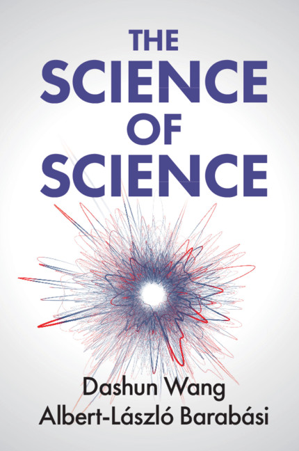

## Relevant Topics

#matthew_effect 

## Relevant Questions

[[QUE - Is citation count a hopelessly confounded metric|QUE - Is citation count a hopelessly confounded metric for evaluating researcher impact?]]

## Quotes, Figures, Evidence

### The Science of career
- Analysis of over 53 million authors and close to 90 million papers showed that both the number of papers and scientists grew exponentially over the past century, with individual productivity (papers per scientist per year) remaining stable at around two for the entire 20th century and increasing to about 2.5 by 2015 #evd-candidate
	Source quote: "the number of papers a scientist produces each year has hovered at around two for the entire 20th century (Fig 1.1.1b, blue curve), and has even increased slightly during the past 15 years. As of 2015, the typical scientist authors or co-authors about 2.5 papers per year."
	Section: Chapter 1.1 - How much do we publish?
	- The distribution of the number of papers published by over 3 million authors in the INSPECT database (1969-2004) followed a lognormal distribution, as first proposed by Shockley based on publication records at national labs #evd-candidate
		- Source quote: "Evidence for (1.1.1) is shown in Fig. 1.1.2, plotting the distribution of the number of papers written by all authors listed in INSPECT, together with a lognormal fit"
		- Section: Chapter 1.1 - Productivity: The difference
	- A study of more than 15 million scientists between 1996 and 2011 found that less than 1% managed to publish at least one paper every year, yet this stable core produced 41.7% of all papers and 87.1% of all papers with more than 1,000 citations #evd-candidate
		- Source quote: "a study focusing on more than 15 million scientists between 1996 and 2011, found that less than 1% of our colleagues managed to publish at least one paper every year. Hence, only a small fraction of the scientific workforce can maintain a steady stream of publications... this stable core puts out 41.7% of all papers, and 87.1% of all papers with more than 1,000 citations."
		- Section: Chapter 1.1 - How much do we publish?
	- The lognormal distribution of scientific productivity arises because publishing a paper requires clearing multiple independent hurdles (identifying a problem, making progress, writing, etc.), and the multiplicative nature of these factors transforms small individual differences into large productivity variations #clm-candidate
		- Source quote: "If each of these odds are independent random variables, then the multiplicative nature of the process predicts that P(N) follows a lognormal distribution of the form (1.1.1)."
		- Section: Chapter 1.1 - Why so productive?
	- Hirsch found that among condensed matter physicists, the h-index measured at 12 years into a career was the best predictor of cumulative citations at year 24, outperforming total citations, total publications, and citations per paper #evd-candidate
		- Source quote: "By measuring the correlation coefficient between future cumulative citations at time t2 and four different metrics calculated at time t1, he found that the h index and the number of citations at time t1 turn out to be the best predictors"
		- Section: Chapter 1.2 - The predictive power of the h index
	- In a randomized experiment at the 2017 WSDM computer science conference, well-known authors were 63% more likely to have papers accepted under single-blind review than double-blind review, authors from top universities had a 58% increase, and authors from Google, Facebook, or Microsoft saw acceptance rates increase by 110% #evd-candidate
		- Source quote: "Well-known author—defined as having at least three papers accepted by previous WSDM conferences and at least 100 computer science papers in total—were 63% more likely to have the paper accepted under single-blind review than in double-blind review... authors from top universities had a 58% increase in acceptance once their affiliation was known... for authors working at Google, Facebook or Microsoft... the acceptance rate more than doubled, increasing by 110%."
		- Section: Chapter 1.3 - What's in a name?
	- For well-known physicists, papers acquired citations exceeding preferential attachment predictions until reaching approximately 40 citations (cx ≈ 40), compared to cx ≈ 10 for junior faculty, suggesting a four-fold early citation premium for senior authors #evd-candidate
		- Source quote: "for a group of well-known physicists, preferential attachment turns on only after the paper has acquired around 40 citations (cx ≈ 40)... for junior faculty in physics (assistant professors), cx drops from 40 to 10. In other words, right after its publication a senior author's paper is four times more likely to be cited than a junior author's."
		- Section: Chapter 1.3 - Boosting Impact
	- The reputation effect on citations is temporary: well-known authors enjoy an early citation premium, but over time this effect vanishes and a paper's long-term impact is driven primarily by the collective perception of the inherent value of the discovery #clm-candidate
		- Source quote: "well-known authors enjoy an early citation premium, representing better odds of their work to be noticed by the community. This leads to a leg-up in early citations. But with time, this reputation effect vanishes, and preferential attachment takes over, whose rate is driven primarily by the collective perception of the inherent value of the discovery."
		- Section: Chapter 1.3 - Boosting Impact
	- Analysis of 124 Nobel laureates showed that publication of a major discovery increased citation rates of the author's previously published papers, including papers not related to the topic of the new discovery #evd-candidate
		- Source quote: "Analyses of 124 Nobel laureates show that this boost is common: The publication of a major discovery increases the citation rates of papers the author published before. Interestingly, the older papers that enjoyed the citation boosts are not necessarily related to the topic of the new discovery."
		- Section: Chapter 1.3 - Boosting Impact
	- The age distribution of Nobel Prize winners and great technological innovators of the 20th century showed peak achievement between ages 30-40, with 42% in their 30s, 30% in their 40s, and 14% beyond age 50, and the peak age shifted upward by about six years over the course of the 20th century #evd-candidate
		- Source quote: "While there are many great innovations by individuals in their 30s (42%), a high fraction contributed in their 40s (30%), and some 14% had their breakthrough beyond the age of 50... the great achievements by both Nobel laureates and inventors have occurred at later and later ages, with the mean peak age rising by about six years in total."
		- Section: Chapter 1.4 - When do scientists do their greatest work?
	- Among Nobel-winning economists classified as conceptual vs. experimental innovators, conceptual laureates made their most important contributions at an average age of 35.8, while experimental laureates did so at an average age of 56—a 20.2-year difference #evd-candidate
		- Source quote: "Conceptual laureates made their most important contributions to science at the average age of 35.8. Compare that to the average age of 56 for experimental laureates—a staggering difference of 20.2 years."
		- Section: Chapter 1.4 - Experimental vs. Conceptual Innovators
	- Analysis of 2,856 physicists with careers spanning at least 20 years showed that the distribution of when a scientist's highest-impact paper appeared was indistinguishable from a randomized version where paper impacts were shuffled within each career, establishing the random impact rule #evd-candidate
		- Source quote: "the two curves in Fig. 1.5.2 are right on top of each other. In other words, the timing of the best works in the randomly shuffled careers is indistinguishable from the original data."
		- Section: Chapter 1.5 - Random Impact Rule
	- The apparent link between youth and scientific breakthroughs is an artifact of higher productivity early in careers: when adjusting for productivity, high-impact work occurs randomly over the course of a career #clm-candidate
		- Source quote: "young scientists have a disproportionate number of breakthroughs early in their career not because youth and creativity are intertwined, but simply because they're in their most productive period. In other words, when we adjust for productivity, high impact work will occur randomly over the course of a career."
		- Section: Chapter 1.5 - Random Impact Rule
	- The random impact rule held not only for the highest-impact work but also for the second and third highest-impact works, and extended beyond science to careers of 3,480 artists (measured by auction prices) and 6,233 film directors (measured by IMDb ratings) #evd-candidate
		- Source quote: "the big break of your career can come at any time, and this pattern is not limited to your highest impact work—your other important works are equally random. And this random impact rule holds not only in scientific careers, but also in careers across different creative domains, like artists and film directors"
		- Section: Chapter 1.5 - Random Impact Rule
	- A purely random (R-model) assignment of paper impact underestimated the relationship between productivity N and highest-impact paper citations: in real careers, the impact of the highest-impact work increased faster with N than the R-model predicted, indicating that individual differences beyond luck are needed to explain career impact #evd-candidate
		- Source quote: "The measurements indicate that in real careers the impact of the highest impact work increases faster with N than the R-model predicts (Fig. 1.6.1). In other words, as scientists become more productive, their home run papers are much more impactful than what we would expect if impact is like a lottery ticket, randomly assigned."
		- Section: Chapter 1.6 - Pure coincidence
	- A scientist's career impact can be decomposed into two factors: a random luck component (the idea value r) that is independent of the scientist, and a Q-factor unique to each individual that captures their ability to consistently turn ideas into high-impact publications #clm-candidate
		- Source quote: "the impact of each paper we publish, c10, is determined by two factors: luck (r) and the Qi parameter unique to individual i... scientists source their ideas randomly from a P(r) distribution that is the same for all individuals, capturing a universal—that is, scientist-independent—luck component behind impact."
		- Section: Chapter 1.6 - The Q-model
	- Comparison of early-career and late-career Q parameters for 823 scientists with at least 50 papers showed that Q_late was proportional to Q_early, with 95.1% of careers showing changes within the fluctuations predicted by shuffled careers, indicating Q is relatively stable throughout a career #evd-candidate
		- Source quote: "For most of the careers (95.1%), the changes between early- and late-career stages fall within the fluctuations predicted by the shuffled careers, suggesting that the Q parameter is relatively stable throughout a career."
		- Section: Chapter 1.6 - What is your Q?
	- In a ROC analysis predicting Nobel laureates among physicists, the Q-factor achieved the highest accuracy (0.94), outperforming h-index (0.90), highest-impact paper citations (0.88), total citations (0.86), and productivity (0.65) #evd-candidate
		- Source quote: "the career-based Q factor wins out, predicting Nobel careers more accurately than all other measures tested in Fig. 1.6.4"
		- Section: Chapter 1.6 - Predicting impact
	- Citation count is significantly confounded by author reputation: prominent scientists receive an early citation premium that inflates their citation counts beyond what the inherent quality of their work would predict, though this effect fades over time #clm-candidate
		- Source quote: "well-known authors enjoy an early citation premium, representing better odds of their work to be noticed by the community. This leads to a leg-up in early citations. But with time, this reputation effect vanishes"
		- Section: Chapter 1.3 - Boosting Impact
	- The two most important works of a scientist were on average 1.57 times more likely to occur back-to-back than expected by chance, and this temporal clustering of hits extended to the top three works and was observed across scientists, artists, and film directors #evd-candidate
		- Source quote: "The two most important works of a scientist are on average 1.57 times more likely to occur back-to-back than we'd expect to see by chance."
		- Section: Chapter 1.7 - Bursts of hits
	- About 90% of scientists experienced at least one hot streak, with 68% experiencing only one; hot streaks lasted a median of approximately 3.7 years for scientists and occurred randomly within the career sequence #evd-candidate
		- Source quote: "About 90% of scientists experience at least one hot streak... 68% of high impact scientists experience only one hot streak... The duration distribution of hot streaks peaks around 3.7 years for scientists"
		- Section: Chapter 1.7 - The hot-streak model
	- No single bibliometric metric can fully capture a scientist's contribution; the h-index, while widely used and relatively effective, fails to account for highly cited outlier papers, inter-field differences, career stage, and collaboration patterns #clm-candidate
		- Source quote: "No scientist's career can be summarized by a single number. Any metric, no matter how good it is at achieving its stated goal, has limitations that must be recognized before it is used to draw conclusions about a person's productivity, the quality of her research, or her scientific impact."
		- Section: Chapter 1.2 - Limitations of the h-Index
	- In a survey experiment, economics professors rated fake CVs listing only top-tier journal publications at 8.1 out of 10, while CVs with the same top-tier papers plus additional lower-tier publications received only 7.6, indicating that additional lower-impact publications actually lowered expert assessments #evd-candidate
		- Source quote: "the short CVs listing only top publications received a rating of 8.1. The long CVs—which, remember, contained the same top-tier papers as the short CVs but with additional lower-tiered publications—received an average rating of 7.6."
		- Section: Chapter 1.6 - Predicting impact
	- The Q-factor better captures how experts evaluate scientists than cumulative metrics like h-index because Q penalizes inconsistency: adding lower-impact papers can decrease Q even though it would increase h-index, total citations, and publication count #clm-candidate
		- Source quote: "In contrast to other measures, Q doesn't simply grow with an expanding publication list. Instead, it depends on if the additional papers are, on average, better or worse than your other papers... the purpose of Q is to quantify a scientist's consistent ability to put out high impact papers over the course of her career."
		- Section: Chapter 1.6 - Predicting impact

### The science of collaboration

-  Analysis of 19.9 million research articles and 2.1 million patents revealed a nearly universal shift toward team-authored work across all branches of science, with team-authored papers rising from about 50% in 1955 to 80% by 2000 in science and engineering #evd-candidate
	Source quote: "a study that explored the authorship of 19.9 million research articles and 2.1 million patents [2], revealing a nearly universal shift towards teams in all branches of science (Fig. 2.1.1a). For example, in 1955, nearly half of all science and engineering publications were by single authors, but by 2000, the number of solo-authored papers had dwindled dramatically, while team-authored papers now made up 80% of all publications."
	Section: Chapter 2.1
	- Team-authored papers garnered more citations than single-authored work at all points in time and across all broad research areas, and the higher impact of team-authored papers remained unchanged after removing self-citations #evd-candidate
		- Source quote: "on average, team-authored papers garner more citations than single-authored work at all points in time and across all broad research areas... the higher impact of team-authored paper remains unchanged if we remove self-citations [5, 6]."
		- Section: Chapter 2.1
	- In science and engineering, a team-authored paper was 6.3 times more likely than a solo-authored paper to receive at least 1,000 citations #evd-candidate
		- Source quote: "Today in science and engineering a team-authored paper is 6.3 times more likely than a solo-authored paper to receive at least 1,000 citations."
		- Section: Chapter 2.1
	- Teams were 37.7% more likely than solo authors to insert novel combinations of ideas into familiar knowledge domains, based on analysis of scientific publications #evd-candidate
		- Source quote: "teams are 37.7% more likely than solo authors to insert novel combinations into familiar knowledge domains [7]."
		- Section: Chapter 2.1
	- After a star scientist arrived at an evolutionary biology department, department-level citation-weighted publication output increased by 54%, and by 48% even after removing the star's own contributions, based on analysis of 255 departments and 149,947 articles (1980-2008) #evd-candidate
		- Source quote: "They found that after a star arrived, the department-level output (measured in number of publications, with each paper weighted by its citation count) increased by 54%. This increase could not be attributed to the publications of the stars themselves: After removing the direct contributions of the star, the output of the department still increased by 48%."
		- Section: Chapter 2.2
	- Following a superstar scientist's unexpected death, coauthors experienced a lasting 5% to 8% decline in quality-adjusted publication rates, with coauthors on similar topics experiencing sharper declines than those on distant topics #evd-candidate
		- Source quote: "Following a superstar's death, her collaborators experienced a lasting 5% to 8% decline in their quality-adjusted publication rates. Interestingly, these effects appear to be driven primarily by the loss of an irreplaceable source of ideas rather than a social or physical proximity."
		- Section: Chapter 2.2
	- The distribution of number of collaborators per scientist in biology, physics, and mathematics coauthorship networks was fat-tailed, with biology having the longest tail and mathematics decaying fastest #evd-candidate
		- Source quote: "Each of these distributions is fat-tailed, indicating that, regardless of their discipline, almost all scientists work with only a few coauthors, while a rare fraction accumulates an enormous number of collaborators."
		- Section: Chapter 2.3
	- The typical shortest path between any two scientists in coauthorship networks was about six links across biology, physics, computer science, mathematics, and neuroscience #evd-candidate
		- Source quote: "if we measure the minimum number of links that separate any two scientists in a coauthorship network, the typical distance is about six links. This pattern holds for biologists, physicists, computer scientists [39], mathematicians and neuroscientists [37]."
		- Section: Chapter 2.3
	- Analysis of Broadway musical collaborations showed that team performance (box office earnings and critics' reviews) had a non-linear relationship with network small-worldliness, peaking at intermediate connectivity levels #evd-candidate
		- Source quote: "researchers found that W correlates with team performance. When a team is embedded in a low-W network, the creative artists are less likely to develop successful shows... But only to a certain degree. The same study shows that too much connectivity and cohesion (high W network) can also become a liability for creativity."
		- Section: Chapter 2.3
	- In basketball and soccer, teams with the greatest proportion of elite athletes performed worse than those with more moderate proportions of top players, but this effect was absent in baseball, which depends less on coordination #evd-candidate
		- Source quote: "researchers found that in both basketball and soccer, the teams with the greatest proportion of elite athletes performed worse than those with more moderate proportions of top players [50]. In baseball, however, extreme accumulation of top talent did not have the same negative effect."
		- Section: Chapter 2.4
	- Analysis of over 9 million papers by 6 million scientists found that ethnic diversity on a team correlated more strongly with five-year citation counts (r=0.77) than diversity in age (r=0.65), gender (r=0.45), or affiliation (r=0.28), with ethnic diversity associated with a 10.63% impact gain after controlling for confounds #evd-candidate
		- Source quote: "ethnic diversity correlated with impact more strongly than did any other category (Fig. 2.4.1 Panel a)... Ethnic diversity on a team was associated with an impact gain of 10.63%."
		- Section: Chapter 2.4
	- Analysis of 473 researchers and 166,000 collaborators in cell biology and physics found that 60-80% of collaboration ties lasted only a single year, while super-ties (coauthoring more than half of papers together) yielded roughly 8 times higher productivity and 17% more citations than other collaborations #evd-candidate
		- Source quote: "out of the more than 166,000 collaboration ties, 60–80% lasted for only a single year... her productivity with the super tie was roughly 8 times higher. Similarly, the additional citation impact from each super tie is 14 times larger than the net citation impact from all other collaborators. For both biology and physics, publications with super-ties receive roughly 17% more citations than their counterparts."
		- Section: Chapter 2.4
	- As teams grew from 1 to 50 members, the disruptive nature of their papers, patents, and software products dropped by 70, 30, and 50 percentiles respectively, while citation counts increased with team size, based on analysis of Web of Science articles, USPTO patents, and GitHub software projects #evd-candidate
		- Source quote: "as teams grow from 1 to 50 members, the disruptive nature of their papers, patents, and products drops by 70, 30 and 50 percentiles, respectively."
		- Section: Chapter 2.5
	- Large teams develop existing science and technology by building on recent high-impact work, while small teams disrupt science by exploring older, less popular ideas and opening novel directions #clm-candidate
		- Source quote: "small teams disrupt science and technology by exploring and amplifying promising ideas from older and less popular work, whereas large teams build on more recent results by solving acknowledged problems and refining existing designs."
		- Section: Chapter 2.5
	- Female economists who collaborated with male economists received essentially zero career benefit from those co-authored papers toward tenure, while male economists received equal credit for solo and collaborative work, based on analysis of faculty at top 30 US economics departments (N=552) #evd-candidate
		- Source quote: "When a female economist collaborates with one or more male economists, her tenure prospects don't improve at all. In other words, when it comes to tenure, women get essentially zero credit if they collaborate with men."
		- Section: Chapter 2.6
	- The Matthew effect in scientific credit allocation causes more eminent scientists to receive disproportionately greater credit for collaborative work regardless of actual contributions, while also protecting them from blame when papers are retracted #clm-candidate
		- Source quote: "when scientists with different levels of eminence are involved in a joint work, the more renowned scientists get disproportionally greater credit, regardless of who did what in the project... when senior and junior authors are involved with the same retracted papers, senior authors can escape mostly unscathed from the fallout of the retraction while their junior collaborators... are often penalized"
		- Section: Chapter 2.7
	- A collective credit allocation algorithm based on co-citation patterns correctly identified Nobel laureates as the highest-credit authors in 81% (51 out of 63) of multi-author Nobel prize-winning publications, regardless of whether author ordering was alphabetical or contribution-based #evd-candidate
		- Source quote: "when applied to all multi-author Nobel prize-winning publications, the method correctly identified the laureates as the authors deserving the most credit 81% of the time (or, in 51 out of 63 papers)."
		- Section: Chapter 2.7
	- Citation counts as a measure of scientific impact are confounded by team size, collaboration patterns, institutional prestige, and credit allocation biases, meaning that a researcher's citation count reflects not just their scientific contributions but also their network position, team composition, and social status #clm-candidate
		- Source quote: "credit is collectively determined by the scientific community, not by individual coauthors. Indeed, individual team-members are often left helpless when their true contribution differs from what is perceived by the community."
		- Section: Chapter 2.7
	- Alphabetical author ordering in fields like economics enables gender-based credit misallocation, whereas contribution-based ordering as in sociology can eliminate this bias #clm-candidate
		- Source quote: "it appears that by listing authors in order of their contributions, scientists can eliminate the impulse to make inferences and assumptions based on bias. By contrast, most economics papers list authors alphabetically, a process that allows gender-based judgments, however unconscious, to have a devastating power."
		- Section: Chapter 2.6
	- Analysis of approximately 80,000 PLoS ONE articles (2006-2014) confirmed that first authors made the largest number of contributions across all team sizes, last authors contributed the second most, and contributions by third through later-middle authors were statistically indistinguishable #evd-candidate
		- Source quote: "Regardless of how many authors are on the paper, the first author always makes the largest number of contributions, and the last author usually contributes the second most (Fig. 2.6.1B). Interestingly, however, only the first and the last authors stand out—followed by the second author but with almost no detectable difference in contributions for all other authors on the paper."
		- Section: Chapter 2.6
	- Both small and large teams are essential for a healthy scientific ecosystem because they produce fundamentally different types of contributions: small teams generate disruptive ideas while large teams develop and refine existing knowledge #clm-candidate
		- Source quote: "Therefore both small and large teams are crucial to a healthy scientific ecosystem... Large teams remain as an important problem-solving engine for driving scientific and technological advances... there is a key role in science for bold solo investigators and small teams, who tend to generate new, disruptive ideas"
		- Section: Chapter 2.5

### The science of impact

- The number of papers indexed yearly by Web of Science showed exponential growth over more than a century, with the total number doubling roughly every 12 years, interrupted only temporarily by the two World Wars. #evd-candidate
	Source quote: "for over a century the number of published papers has been increasing exponentially. On average, the total number has doubled roughly every 12 years."
	Section: Chapter 3.1 - The Exponential Growth of Science
	- Of 58 million papers indexed in the Science Citation Index by 2014, nearly half had never been cited, while only the top 1.5 meters of a hypothetical stack (papers with ≥1,000 citations) and 1.5 centimeters (papers with ≥10,000 citations) represented the most impactful work. #evd-candidate
		- Source quote: "the bottom 2,500 meters—nearly half of the mountain—would consist of papers that have never been cited. At the other extreme, the top 1.5 meters would consist of papers that have received at least 1,000 citations."
		- Section: Chapter 3.2 - Citation Disparity
	- When citation distributions for papers published in 1999 across multiple disciplines were rescaled by the average number of citations in the same field and year, they collapsed onto a single universal lognormal function. #evd-candidate
		- Source quote: "When the raw citation counts are normalized in this way, we find that the distribution for every field now neatly follows a single universal function"
		- Section: Chapter 3.2 - Universality of citation distributions
	- Raw citation counts cannot be meaningfully compared across disciplines because citation rates differ systematically between fields, but normalizing by field and year averages reveals a universal citation distribution. #clm-candidate
		- Source quote: "These systematic differences indicate that simply comparing the number of citations received by two papers in different disciplines would be meaningless."
		- Section: Chapter 3.2 - Universality of citation distributions
	- Citations correlated positively with other measures of scientific impact or recognition, including awards, reputation, peer ratings, and authors' own assessments of their contributions, across multiple studies. #evd-candidate
		- Source quote: "Overall, they find that citations correlate positively with other measures of scientific impact or recognition, including awards, reputation, peer ratings, as well as the authors' own assessments of their scientific contributions"
		- Section: Chapter 3.2 - What do citations (not) capture?
	- In a survey of the 400 most-cited biomedical scientists, the vast majority reported that their most highly cited paper was also their most important one. #evd-candidate
		- Source quote: "a survey of the 400 most-cited biomedical scientists asked each of them a simple question: Is your most highly cited paper also your most important one? The vast majority of this elite group answered yes"
		- Section: Chapter 3.2 - What do citations (not) capture?
	- When ~2,000 authors from two universities were asked to compare pairs of papers, they systematically picked their better-cited paper as more relevant when both were their own, but overwhelmingly preferred their own paper over others' even when the other was among the most cited in the field. #evd-candidate
		- Source quote: "If both papers offered had been authored by the researcher, he systematically picked his better cited paper as the more relevant one. If, however, the author was asked to compare his paper with a paper by someone else, he overwhelmingly preferred his own paper"
		- Section: Chapter 3.2 - What do citations (not) capture?
	- Citation counts represent the collective wisdom of the scientific community on a paper's importance, because no single scientist can unilaterally cause a paper to amass citations. #clm-candidate
		- Source quote: "There is not one scientist in the world who can single-handedly demand that a paper amass citations. Each of us decides on our own whose shoulders to stand upon"
		- Section: Chapter 3.2 - What do citations (not) capture?
	- The rich-get-richer mechanism (preferential attachment) combined with the growth of the scientific literature is sufficient to explain the fat-tailed citation distribution and citation superstars, independent of discipline-specific factors. #clm-candidate
		- Source quote: "Growth and preferential attachment, together leading to a rich-get-richer effect, can fully account for the observed citation disparity, pinpointing the reason why citation superstars emerge"
		- Section: Chapter 3.3 - The Rich-Get-Richer Phenomenon
	- In network science, the first 10% of papers published in the field received an average of 101 citations, while the second 10% received just 26 on average, demonstrating a first-mover advantage. #evd-candidate
		- Source quote: "The first 10% of papers published in this field received an average 101 citations, while the second 10% received just 26 on average."
		- Section: Chapter 3.3 - First-Mover Advantage
	- Analysis of 17.9 million papers spanning all scientific fields found that papers introducing novel journal combinations while remaining embedded in conventional work were at least twice as likely to be hits as the average paper. #evd-candidate
		- Source quote: "papers that introduced novel combinations, yet remained embedded in conventional work, were at least twice as likely to be hits than the average paper"
		- Section: Chapter 3.4 - The link between novelty and scientific impact
	- NEJM articles covered by The New York Times received 72.8% more citations in the first year than non-covered articles, but during a 12-week Times strike when selected articles were not published to the public, this citation advantage disappeared entirely. #evd-candidate
		- Source quote: "articles covered by the Times received 72.8% more citations in the first year than the non-covered group...During this period, researchers found, the citation advantage disappeared entirely"
		- Section: Chapter 3.4 - Publicity (good or bad) amplifies citations
	- Media coverage causally amplifies a paper's citation count beyond what would be expected from the paper's intrinsic quality alone. #clm-candidate
		- Source quote: "the citation advantage of attention-grabbing papers cannot be explained solely by their higher quality, novelty, or even mass appeal—it is also the result of media coverage itself."
		- Section: Chapter 3.4 - Publicity (good or bad) amplifies citations
	- Papers criticized in published comments were not only cited more than non-commented papers but were also significantly more likely to be among the most cited papers in a journal. #evd-candidate
		- Source quote: "Commented papers are not only cited more than non-commented papers—they are also significantly more likely to be among the most cited papers in a journal"
		- Section: Chapter 3.4 - Publicity (good or bad) amplifies citations
	- Analysis of 28 million papers in Web of Science showed that papers with low mean reference age and high age variance (mixing recent and vintage references) were 2.2 times more likely to become top 5% cited papers in their subfield than randomly chosen papers. #evd-candidate
		- Source quote: "Papers of this sort are 2.2 times more likely to become homeruns in their field than a randomly chosen publication."
		- Section: Chapter 3.5 - The Hotspot of Discovery
	- The average age of references in papers stayed around 7.5 years from 1950 to 1970, then showed a remarkable increasing trend through 2010, indicating scientists are systematically reaching deeper into the literature over time. #evd-candidate
		- Source quote: "The average age of the references of papers stayed around 7.5 years from 1950 to 1970, after which we observe a remarkable increasing trend, indicating that scientists are systematically reaching deeper into the literature."
		- Section: Chapter 3.5 - The Growing Impact of Older Discoveries
	- Citations of individual papers followed a jump-decay pattern on average, with citation rate rising quickly after publication, peaking around year two or three, then declining, based on analysis of papers across multiple publication decades. #evd-candidate
		- Source quote: "citations follow a jump-decay pattern: a paper's citation rate rises quickly after publication, reaching a peak around year two or three, after which it starts to drop."
		- Section: Chapter 3.5 - Your expiration date
	- When approximately 8,000 physics papers published between 1950 and 1980 in Physical Review were rescaled using three fitted parameters (fitness, immediacy, longevity), their diverse citation histories collapsed onto a single universal curve. #evd-candidate
		- Source quote: "We rescaled all the papers published between 1950 and 1980 in Physical Review that garnered more than 30 citations in 30 years (∼8,000 papers)."
		- Section: Chapter 3.6 - Citation Dynamics: Remarkably Universal
	- A paper's ultimate lifetime citation count is determined solely by its relative fitness parameter, independent of the journal in which it was published or its immediacy and longevity parameters. #clm-candidate
		- Source quote: "when it comes to ultimate impact, according to (1.3), only one parameter is relevant: the relative fitness λ. It does not matter how soon the paper starts to garner attention (immediacy, μ) or how fast its appeal decays over time (longevity, σ)."
		- Section: Chapter 3.6 - Ultimate Impact
	- Papers with comparable fitness (λ≈1) published in Cell (IF=33.62), PNAS (IF=10.48), and Physical Review B (IF=3.26) converged to the same cumulative citation count (~51.5) by year 20, despite initial differences in citation rates. #evd-candidate
		- Source quote: "by year 20 the cumulative number of citations acquired by these papers converges in a remarkable way (B). This is precisely what (1.3) tells us: given their similar fitness λ, eventually these papers should have the same ultimate impact c∞ = 51.5."
		- Section: Chapter 3.6 - Ultimate Impact
	- Citation counts are a meaningful but imperfect proxy for scientific impact, confounded by factors including review paper bias, negative citations, perfunctory citations, discipline differences, media coverage, and preferential attachment effects. #clm-candidate
		- Source quote: "it is easy to forget that citations are merely a proxy for impact or scientific quality. Indeed, there are many ground-breaking scientific discoveries that have received relatively few citations, even as less important papers amass hundreds."
		- Section: Chapter 3.2 - What do citations (not) capture?
	- The share of citations received by the top 1% most cited papers in Physical Reviews rose steadily from 1893 to 2009, indicating growing impact disparity in the physical sciences over the past century. #evd-candidate
		- Source quote: "impact disparity in the physical sciences is indeed present, and has been rising steadily over the past century."
		- Section: Box 3.2.3 - The Widening Citation Gap
	- At a leading US medical school, 142 world-class scientists randomly assigned to review 15 grant proposals gave systematically lower ratings to proposals with more novel keyword combinations. #evd-candidate
		- Source quote: "proposals that scored high on novelty received systematically lower ratings than their less novel counterparts."
		- Section: Chapter 3.4 - The Novelty Paradox
	- Novelty in science presents a paradox: novel ideas are more likely to achieve high impact but also more likely to fail, take longer to be recognized, and face bias in peer review and funding decisions. #clm-candidate
		- Source quote: "while novel ideas often to lead to high-impact work, they also lead to higher degrees of uncertainty...the novelty bias observed in grant applications suggests that an innovative scientist may have trouble getting the funding necessary to test these ideas"
		- Section: Chapter 3.4 - The Novelty Paradox