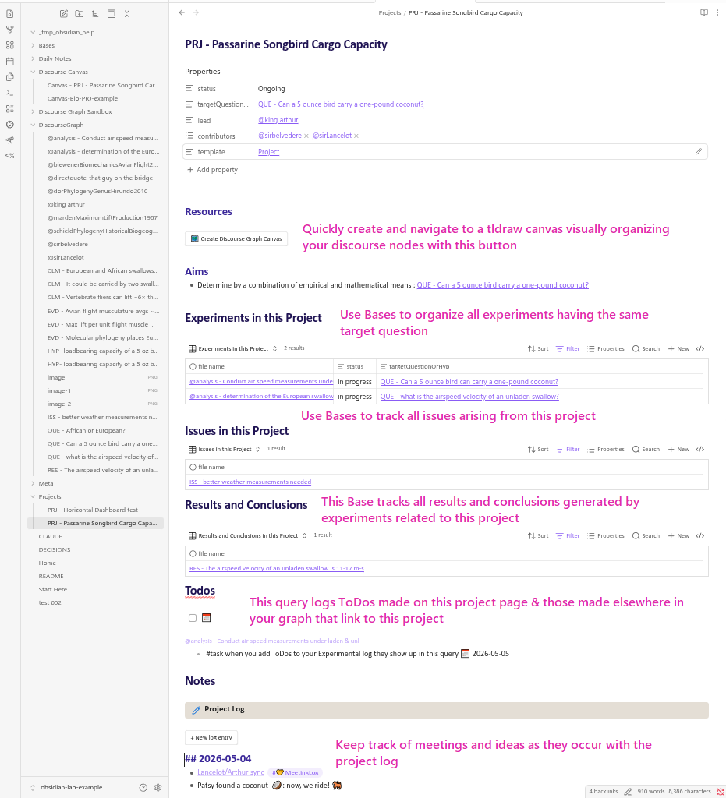
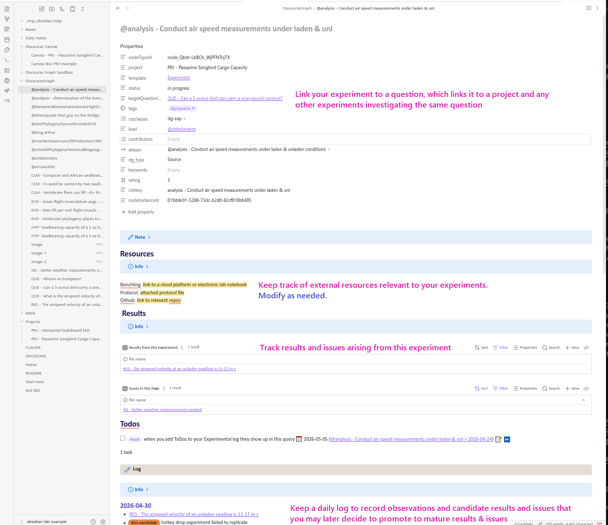
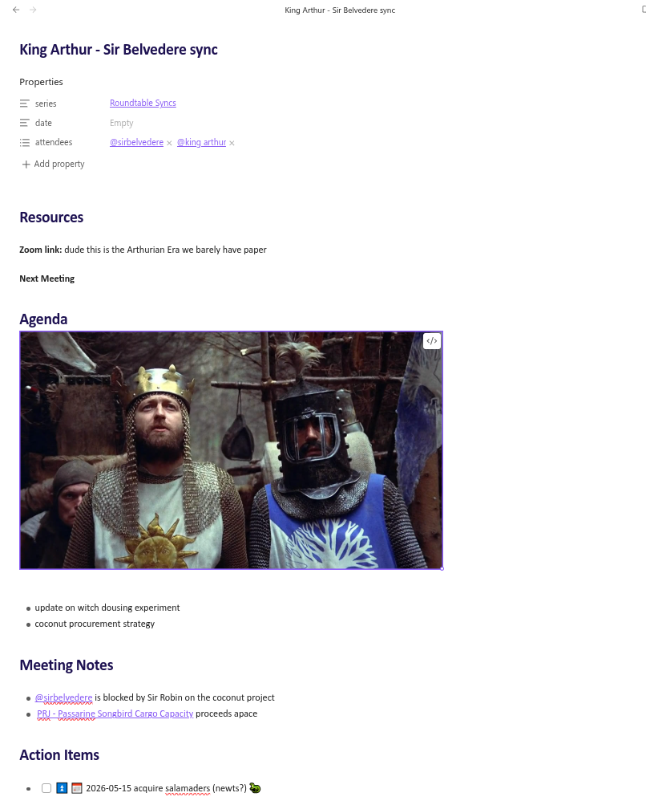
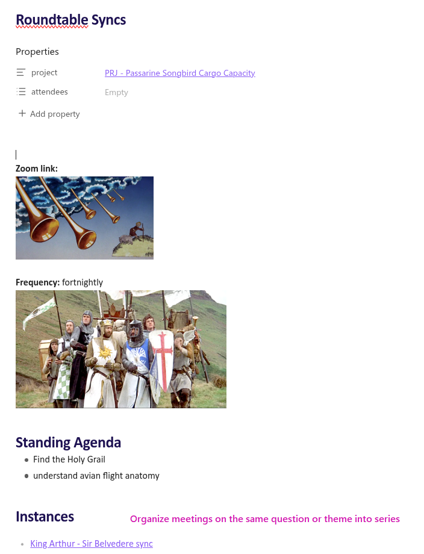
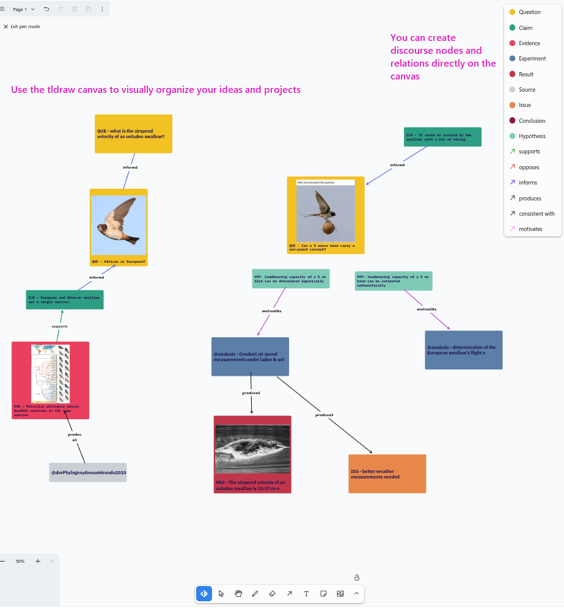

This is an example vault that illustrates potential usage of the [discourse graph plugin](https://discoursegraphs.com/docs/obsidian/getting-started) to structure project/experiment management, and synthesis and reflection of results in conversation with prior literature towards new directions and contributions.
# Plugins in the vault (and why)

## Core

**Bases**: enables queries over discourse nodes, etc. - examples are in the vault

**Backlinks** (optional): nice to have references to a given note easily accessible at the bottom of the page

## Community

### Required

- **[BRAT](https://github.com/TfTHacker/obsidian42-brat)**: this is how we load our plugin at the moment
- **[Datacore](https://github.com/blacksmithgu/datacore)** : this is the query engine that underlies our plugin
- **[Discourse Graph](https://discoursegraphs.com/docs/obsidian/getting-started)** (required): this is our plugin :)

### Recommended
- [Tasks](https://github.com/obsidian-tasks-group/obsidian-tasks) (recommended): makes it easier to create/query/manage todos
- [Outliner](https://github.com/vslinko/obsidian-outliner) (optional): 
- [Calendar](https://obsidian.md/plugins?id=calendar): supports a Daily Notes workflow
- [Style Settings](https://obsidian.md/plugins?id=obsidian-style-settings): adjust themes & CSS snippets
- [Templater](https://obsidian.md/plugins?id=templater-obsidian): create more advanced templates (including the Daily Note Template)
- [Zotsidian](https://github.com/obsidian-community/obsidian-zotero-integration): connect your Zotero library to Obsidian
- [ Obsidian-bases-new-with template](https://github.com/theol0403/obsidian-bases-new-with-template): apply the correct template when you create new discourse nodes directly from your Bases

# Overall structure of the vault (and why)

The current structure of this vault parallels lab discourse graphs workflows we've developed in Roam, modified for the affordances provided by Obsidian/git. But little of this structure is written in stone -- we follow the Obsidian convention that your vault is your own. We've tried to support our reasoning about the folder structure with rationale so that you can make informed decisions about customizing your vault.

- `Bases/` Your `.base` files could also inside their respective content folders (e.g., a `Projects.base` in the Project folder). Putting them in one place allows you to see which bases you've created, which is ==#clm-candidate== more valuable as you set up your vault and less important later.
- `DiscourseGraph/` not a bad idea to set a default location for new discourse nodes ==#hyp-candidate== this separation-of-concerns is especially useful for users grafting the discourse graph protocol onto an mature vault.
- `Meta/`
	- `Attachments/` usually it's good set a folder for attachments to go to, but it can be anywhere
	- `Templates/` the discourse nodes can be created based on a template. the plugin needs to be pointed to a folder that contains templates to use. Templates in these folder can also be used for other notes, not just discourse nodes
	- `Conventions.md` this might be a good place to write down the conventions/workflows for your lab
- `Projects/` pretty self-explanatory, and probably something you want to do to track projects. 
- `Protocols/` optional, if you want to create and track specific protocols and link to them in your experiments, and what questions they can address

# Example Graph

This vault contains an example graph demonstrating how you can use a discourse graph to 
- plan and manage projects
- integrate insights from the literature into your own research
- keep track of tasks and meetings
- design experiments and record experimental data
-  synthesize your research into a story or new initiative
- share your ideas and results with others
-  build and exploit your personal knowledge base

The graph is descriptive, not prescriptive, showcasing specific patterns you can adopt, discard, or adapt to your own needs.

### The Daily Notes Page

### Project pages

**Annotated example**

The structure of the Project page enables you to
- Keep the broad target question(s) close by, provide space for reflecting on what has been learned from the experiments
- Consolidate key links/resources for the project
- Keep a log of project notes

Key actions
- Review progress by pulling in results from each experiment alongside the literature and your questions by placing them on the project canvas
- There is a template in the example vault that you can modify (in `Meta/Templates/Project.md`)

### Experiment pages

**Annotated example**

The structure of the Experiment page enables you to
- Keep target question or hypothesis close by, to define the purpose of the experiment
- Keep an experiment log where you can reflect on observations, and (if appropriate) formalize these into hypotheses or results you want to share with others by creating discourse nodes
- Reflect on progress of the experiment by comparing tabulated results from the experiment against the target question

Key actions
- Set/change the target question by changing it in the `targetQuestionOrHyp` property for the page
- Review progress by comparing the target question to the tabulated results so far. The `.base` query will auto-update

There is a template in the example vault that you can modify (in `Meta/Templates/Experiment.md`)

### Meeting Notes

**Annotated examples**

### The Discourse Canvas

**Annotated Example**

The discourse graph plugin implements a tldraw canvas (distinct from the canvas feature that ships with Obsidian) that allows you to create and manipulate discourse nodes and relations visually. 

# The Decisions and Conventions files

This vault contains two notes, _DECISIONS.md_ and _Conventions.md_, that function as short guides to how this vault was designed. 
- _DECISIONS.md_ records the design decisions involved in the creation of the vault.
- _Conventions.md_ records certain assumptions about how a vault like this might be used.

# Getting Started

Please feel free to organize the vault's folders  according to the organizational structure patterns that work for you.

## Suggestions for how to explore discourse graphs using this example vault

1. Download this example vault (all plugin "batteries" are included already)
2. Choose 1-2 projects that already have some questions/claims/evidence around them, maybe some sub-experiments too
3. For each project
	1. Create the project and its container experiments
	2. Map out the key questions/claims/evidence for the project
	3. Maybe tabulate some logs for ongoing experiments in those projects

### Templates/workflows

At the moment a lot of our lab processes are encoded in "smartblock" workflows and templates. For instance, we have meeting templates that focus attention on research questions, and workflows for creating new projects/experiments that encourage specification of target questions/hypotheses. You may want to start working in similar things to support sufficient (minimal) standardization and shared processes as you collaborate.

Our discourse plugin supports the use of templates when creating discourse nodes, but for more advanced workflow structuring, you might experiment with the Templater plugin: 

Docs: https://silentvoid13.github.io/Templater/

Examples: https://github.com/SilentVoid13/Templater/discussions/categories/templates-showcase

