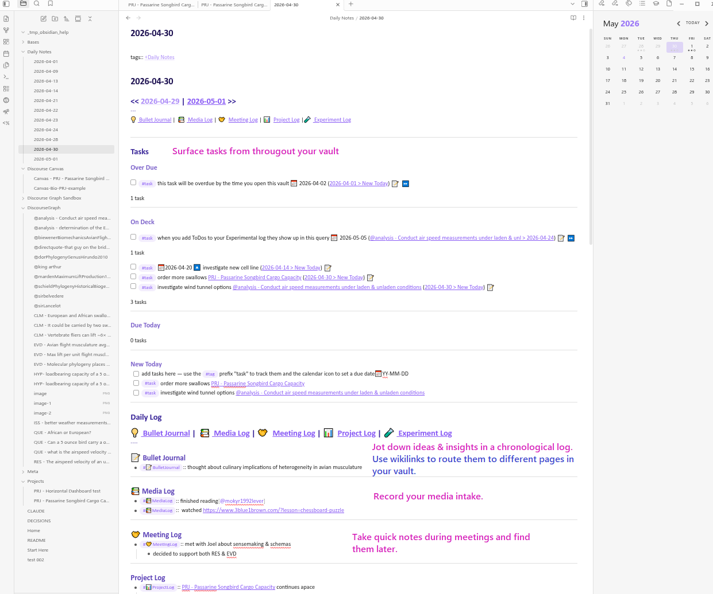
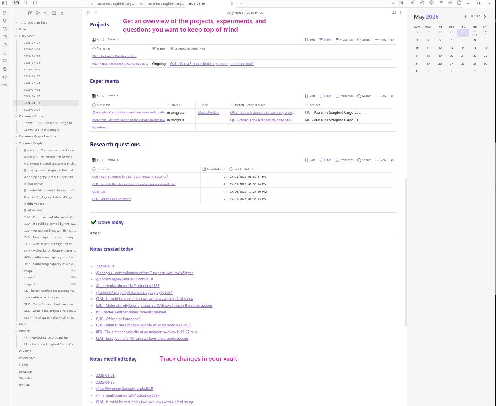
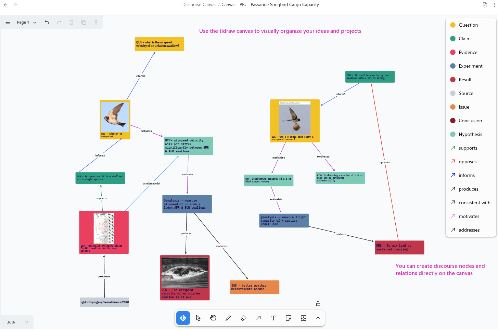

This is an example vault that illustrates potential usage of the [discourse graph plugin](https://discoursegraphs.com/docs/obsidian/getting-started) to structure project/experiment management, and synthesis and reflection of results in conversation with prior literature towards new directions and contributions.
# Plugins in the vault (and why)

## Core

**Bases**: enables queries over discourse nodes, etc. - examples are in the vault

**Backlinks** (optional): nice to have references to a given note easily accessible at the bottom of the page

**Daily Notes**: supports the one-click creation of Daily Notes

## Community

### Required

- **[BRAT](https://github.com/TfTHacker/obsidian42-brat)**: this is how we load our plugin at the moment
- **[Datacore](https://github.com/blacksmithgu/datacore)** : this is the query engine that underlies our plugin
- **[Discourse Graph](https://discoursegraphs.com/docs/obsidian/getting-started)** (required): this is our plugin :)

### Recommended
- [Tasks](https://github.com/obsidian-tasks-group/obsidian-tasks) (recommended): makes it easier to create/query/manage todos
- [Outliner](https://github.com/vslinko/obsidian-outliner) (optional): 
- [Calendar](https://obsidian.md/plugins?id=calendar): supports a Daily Notes workflow
- [Style Settings](https://obsidian.md/plugins?id=obsidian-style-settings): adjust themes & CSS snippets
- [Templater](https://obsidian.md/plugins?id=templater-obsidian): create more advanced templates (including the Daily Note Template)
- [Zotsidian](https://github.com/obsidian-community/obsidian-zotero-integration): connect your Zotero library to Obsidian
- [ Obsidian-bases-new-with template](https://github.com/theol0403/obsidian-bases-new-with-template): apply the correct template when you create new discourse nodes directly from your Bases 

# Overall structure of the vault (and why)

The current structure of this vault parallels lab discourse graphs workflows we've developed in Roam, modified for the affordances provided by Obsidian/git. But little of this structure is written in stone -- we follow the Obsidian convention that your vault is your own. We've tried to support our reasoning about the folder structure with rationale so that you can make informed decisions about customizing your vault.

- `Bases/` Your `.base` files could also inside their respective content folders (e.g., a `Projects.base` in the Project folder). Putting them in one place allows you to see which bases you've created, which is ==#clm-candidate== more valuable as you set up your vault and less important later.
- `DiscourseGraph/` not a bad idea to set a default location for new discourse nodes ==#hyp-candidate== this separation-of-concerns is especially useful for users grafting the discourse graph protocol onto an mature vault.
- `Meta/`
	- `Attachments/` usually it's good set a folder for attachments to go to, but it can be anywhere
	- `Templates/` the discourse nodes can be created based on a template. the plugin needs to be pointed to a folder that contains templates to use. Templates in these folder can also be used for other notes, not just discourse nodes
	- `Conventions.md` this might be a good place to write down the conventions/workflows for your lab
- `Projects/` pretty self-explanatory, and probably something you want to do to track projects. 
- `Protocols/` optional, if you want to create and track specific protocols and link to them in your experiments, and what questions they can address

# Example Graph

This vault contains an example graph demonstrating how you can use a discourse graph to 
- plan and manage projects
- integrate insights from the literature into your own research
- keep track of tasks and meetings
- design experiments and record experimental data
- synthesize your research into a story or new initiative
- share your ideas and results with others
- build and exploit your personal knowledge base

The graph is descriptive, not prescriptive, showcasing specific patterns you can adopt, discard, or adapt to your own needs.

### The Daily Notes Page

This vault uses the _Daily Notes_ core plugin and the _Calendar_  and _Tasks_ community plugins to power a Daily Notes page that can be created by clicking on the appropriate date in the Calendar on the right sidebar.

The Daily Notes Page is intended to serve as a landing page that gives an overview of the current state of your vault and allows short-hop journeys to the most frequented nodes in your graph. 

The example in this vault demonstrates two powerful methods of searching for and interacting with your nodes and nodes: via **Datacore-powered queries** and via **Bases.**

The **Daily Log** and its subcomponents --  the Bullet Journal, Media Log, Meetings Log, Project Log, and Experiment Log -- allow you to jot down simple notes and use wikilinks and hashtags to route them to Datacore queries on the appropriate pages (for example, notes in the Experiment Log linked with [[Experiment Name]] will show up in the daily log on that Experiment Page). Entries will also be sorted chronologically in their respective Log Pages. 

These Datacore queries allow you to search your vault at the sub-file level, surfacing inline content and routing it to multiple destinations. Think of these as logs as a way of chronologically ordering and searching freeform prose.

The **Projects**, **Experiments**, and **Research Questions** Bases display data stored as properties (frontmatter)in a tabular format to give you an overview of the status of your major research  questions and initiatives. 

The _Tasks_ plugin is used to organize the tasks stored throughout your vault and present them in order or urgency.

These patterns can be copied and modified: for example, the Daily Notes Page could be updated to include a "Sources" base that tracks a literature synthesis project.

### Project pages

The Project Page is designed to
- Keep the broad target question(s) front and center
- Consolidate key links/resources for the project
- Keep a log of project notes and provide space for reflecting on what has been learned from the experiments
- link to a **Project Canvas** where you can organize your research into a visual narrative 

**Annotated example**

### Experiment pages

The Experiment Page is designed to
- Forefront the target question or hypothesis, defining the purpose of the experiment
- Keep an experiment log where you can reflect on observations, and (if appropriate) formalize these into hypotheses or results you want to share with others by creating discourse nodes
- Reflect on progress of the experiment by comparing tabulated results from the experiment against the target question

**Annotated example**

### Meeting Notes

You can capture insights and information from regular meetings using the Meeting template...

**Annotated examples**

And track recurring meetings using the Meeting Series template.

### The Discourse Canvas

**Annotated Example**

The discourse graph plugin implements a tldraw canvas (distinct from the canvas feature that ships with Obsidian) that allows you to create and manipulate discourse nodes and relations visually. 

# Getting Started

Please feel free to organize the vault's folders  according to the organizational structure patterns that work for you.

## Suggestions for how to explore discourse graphs using this example vault

1. Download this example vault (all plugin "batteries" are included already)
2. Go through the [[Welcome|Discourse Graph Sandbox]] to get a quick tutorial on how to use discourse graphs to achieve different goal
3. Choose a project that you have in mind or in progress
4. Map out the key questions/claims/evidence for the project using the provided templates
5. Begin visually organizing your work on a discourse canvas

## Templates/workflows

The discourse graph plugin supports the use of **templates** when creating discourse nodes -- these are stored under **Meta/Templates.**

You can modify these templates and their use manually and with the core _Templates_ plugin, but for more advanced workflow structuring, you might experiment with the Templater plugin: 

Docs: https://silentvoid13.github.io/Templater/

Examples: https://github.com/SilentVoid13/Templater/discussions/categories/templates-showcase

## The Decisions and Conventions files

This vault contains two notes, _DECISIONS.md_ and _Conventions.md_, that function as short guides to how this vault was designed. 
- _DECISIONS.md_ records the design decisions involved in the creation of the vault.
- _Conventions.md_ records certain assumptions about how a vault like this might be used.
